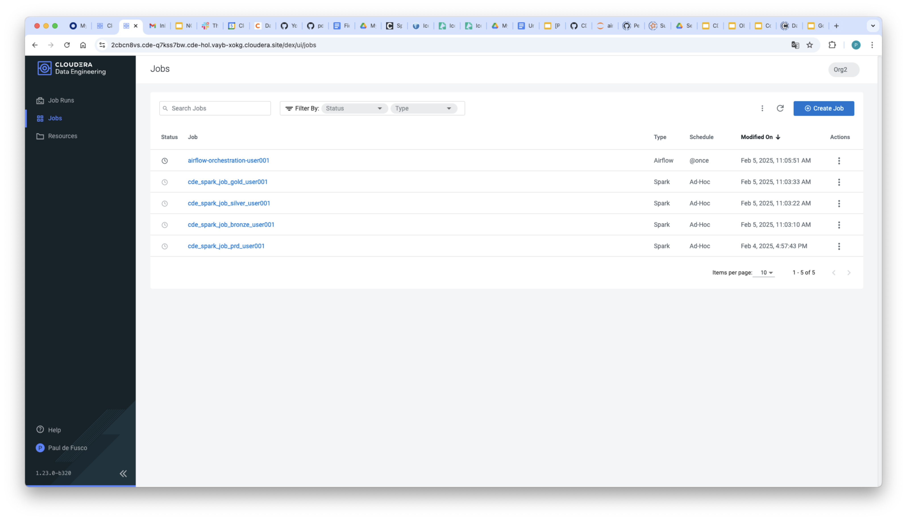
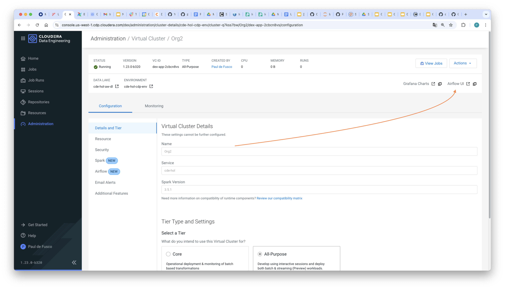

# Despliegue y Orquestación con Airflow en CDE


## Contenido

3. [Promover a un entorno superior usando la API replicando el repositorio y redeplegando](https://github.com/pdefusco/CDE_123_HOL/blob/main/step_by_step_guides/english/03-deployment.md#lab-3-promote-to-higher-env-using-api-by-replicating-repo-and-redeploy)
4. [Construir un pipeline de orquestación con Airflow](https://github.com/pdefusco/CDE_123_HOL/blob/main/step_by_step_guides/english/03-deployment.md#lab-4-build-orchestration-pipeline-with-airflow)

## Laboratorio 3. Promover a un entorno superior usando la API replicando el repositorio y redeplegando

Ahora que el trabajo ha tenido éxito, desplíegalo en tu clúster PRD.

Crea y sincroniza el mismo repositorio Git desde el clúster PRD. A partir de ahora, ejecuta los siguientes comandos CLI con la URL de la API de Jobs de tu clúster PRD como el parámetro vcluster-endpoint.

```
cde repository create \
  --name sparkAppRepoPrdUser001 \
  --branch main \
  --url https://github.com/pdefusco/CDE_123_HOL.git \
  --vcluster-endpoint <tu-URL-de-api-jobs-PRD-vc-aquí>
```

```
cde repository sync \
  --name sparkAppRepoPrdUser001 \
  --vcluster-endpoint <tu-URL-de-api-jobs-PRD-vc-aquí>
```

Luego, crea un trabajo Spark en CDE aprovechando el repositorio de CDE como una dependencia.

```
cde job create --name cde_spark_job_prd_user001 \
  --type spark \
  --mount-1-resource sparkAppRepoPrdUser001 \
  --executor-cores 2 \
  --executor-memory "4g" \
  --application-file pyspark-app.py\
  --vcluster-endpoint <tu-URL-de-api-jobs-PRD-vc-aquí> \
  --arg <tu-ubicación-de-almacenamiento-aquí>
```

```
cde job run --name cde_spark_job_prd_user001 \
  --executor-cores 4 \
  --executor-memory "2g" \
  --vcluster-endpoint <tu-URL-de-api-jobs-PRD-vc-aquí>
```


## Laboratorio 4. Construir un Pipeline de Orquestación con Airflow

Crea los trabajos Spark en CDE. Observa que estos están categorizados en Bronce, Plata y Oro siguiendo una Arquitectura de Datos Lakehouse.

```
cde job create --name cde_spark_job_bronze_user001 \
  --type spark \
  --arg <tu-nombre-de-usuario-cdp-aquí> \
  --arg <tu-ubicación-de-almacenamiento-aquí> \
  --mount-1-resource sparkAppRepoPrdUser001 \
  --python-env-resource-name Python-Env-Shared \
  --executor-cores 2 \
  --executor-memory "4g" \
  --application-file de-pipeline/spark/001_Lakehouse_Bronze.py\
  --vcluster-endpoint <tu-URL-de-api-jobs-PRD-vc-aquí>
```

```
cde job create --name cde_spark_job_silver_user001 \
  --type spark \
  --arg <tu-nombre-de-usuario-cdp-aquí> \
  --mount-1-resource sparkAppRepoPrdUser001 \
  --python-env-resource-name Python-Env-Shared \
  --executor-cores 2 \
  --executor-memory "4g" \
  --application-file de-pipeline/spark/002_Lakehouse_Silver.py\
  --vcluster-endpoint <tu-URL-de-api-jobs-PRD-vc-aquí>
```

```
cde job create --name cde_spark_job_gold_user001 \
  --type spark \
  --arg <tu-nombre-de-usuario-cdp-aquí> \
  --arg <tu-ubicación-de-almacenamiento-aquí> \
  --mount-1-resource sparkAppRepoPrdUser001 \
  --python-env-resource-name Python-Env-Shared \
  --executor-cores 2 \
  --executor-memory "4g" \
  --application-file de-pipeline/spark/003_Lakehouse_Gold.py\
  --vcluster-endpoint <tu-URL-de-api-jobs-PRD-vc-aquí>
```

En tu editor, abre el DAG de Airflow "004_airflow_dag_git" y edita la variable de tu nombre de usuario en la línea 54.


Luego, crea el trabajo de Airflow de CDE. Este trabajo orquestará tus trabajos Spark de Lakehouse mencionados anteriormente.

```
cde job create --name airflow-orchestration-user001 \
  --type airflow \
  --mount-1-resource sparkAppRepoPrdUser001 \
  --dag-file de-pipeline/airflow/004_airflow_dag_git.py\
  --vcluster-endpoint <tu-URL-de-api-jobs-PRD-vc-aquí>
```




No es necesario activar manualmente la ejecución del trabajo de Airflow. Los parámetros del DAG ya incluyen una programación. Al crearse, el trabajo de Airflow de CDE se ejecutará en breve. Puedes seguir el progreso en la interfaz de Job Runs.


Puedes usar la interfaz de Airflow para inspeccionar tus pipelines. Desde la página de detalles del clúster virtual, abre la interfaz de Airflow y localiza tu DAG de Airflow.




Airflow proporciona una variedad de diagramas, gráficos y visuales para monitorear tus ejecuciones a través de tareas, dags y operadores. Ejecuta tu DAG de Airflow varias veces desde la interfaz de Jobs de CDE y vuelve a la interfaz de Airflow para inspeccionar tus tareas a través de diferentes ejecuciones, y mucho más.


CDE Airflow soporta proveedores de terceros, es decir, paquetes externos que amplían la funcionalidad de Apache Airflow añadiendo integraciones con otros sistemas, servicios y herramientas como AWS, Google Cloud, Microsoft Azure, bases de datos, brokers de mensajes y muchos otros servicios. Los proveedores son de código abierto y se pueden instalar por separado según las necesidades específicas de un proyecto.

Selecciona la tarea GitHub List Repos, abre los registros y observa que se proporciona la salida. En esta tarea en particular utilizaste el GitHub Operator para listar repositorios desde una cuenta de GitHub.


Se creó una conexión de Airflow de antemano para conectarse a esta cuenta mediante un token de GitHub. Abre la página de Conexiones para explorar más conexiones.


El GitHub Operator fue instalado en el entorno Python de Airflow del Clúster Virtual. Regresa a la página de detalles del Clúster Virtual, abre la pestaña de Airflow y valida los paquetes instalados.


## Resumen y Próximos Pasos

Apache Airflow es una herramienta de automatización y orquestación de flujos de trabajo de código abierto diseñada para programar, monitorear y gestionar pipelines de datos complejos. Permite a los usuarios definir flujos de trabajo como Grafos Acíclicos Dirigidos (DAGs) usando Python, lo que permite flexibilidad, escalabilidad y automatización en el procesamiento de datos. Con integraciones integradas, una interfaz web fácil de usar y potentes capacidades de ejecución de tareas, Airflow se usa ampliamente en ingeniería de datos, procesos ETL y pipelines de aprendizaje automático.

CDE integra Apache Airflow a nivel de CDE Virtual Cluster. Se despliega automáticamente para el usuario de CDE durante la creación del CDE Virtual Cluster y no requiere mantenimiento por parte del administrador de CDE.

En esta sección de los laboratorios desplegamos un pipeline de Spark e Iceberg con repositorios git y CDE, y creamos un pipeline de orquestación de trabajos con Airflow. También podrías encontrar los siguientes artículos y demostraciones relevantes:

* [Documentación de CDE Airflow](https://docs.cloudera.com/cdp-private-cloud-upgrade/latest/cdppvc-data-migration-spark/topics/cdp-migration-spark-cde-airflow-overview.html)
* [Uso de Airflow en CDE](https://docs.cloudera.com/cdp-private-cloud-upgrade/latest/cdppvc-data-migration-spark/topics/cdp-migration-spark-cde-using-airflow.html)
* [Creación de un repositorio CDE en CDE](https://docs.cloudera.com/data-engineering/1.5.4/manage-jobs/topics/cde-git-repo.html)
