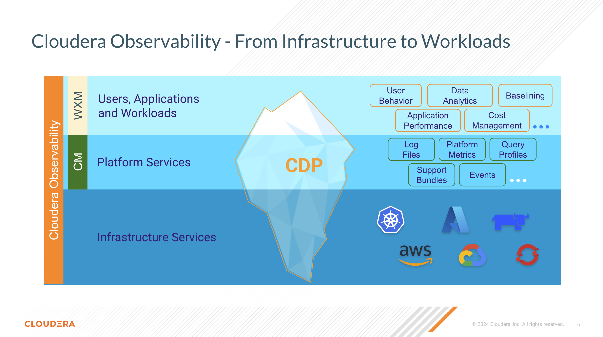
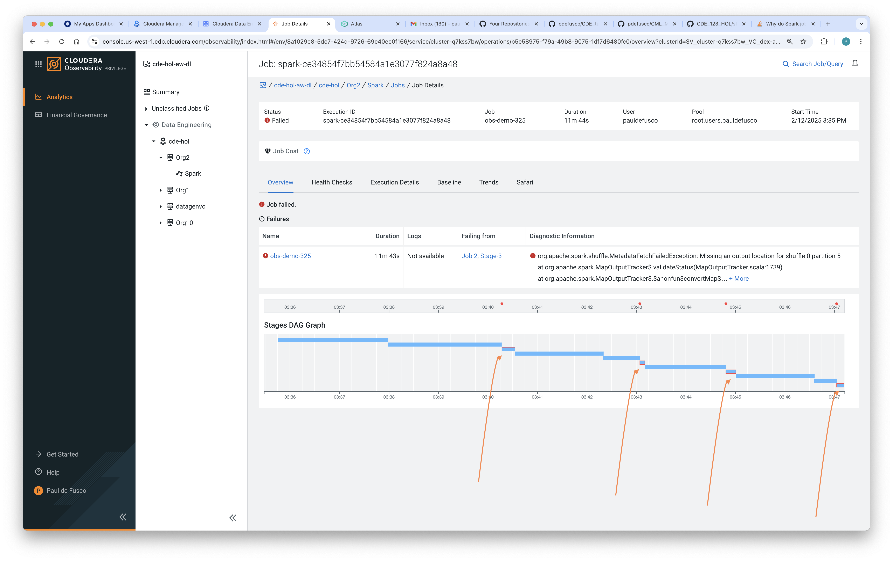

# Observabilidad de Trabajos y Gobernanza de Datos en CDP

## Contenido

5. [Monitorear trabajos con Cloudera Observability y CDE](https://github.com/pdefusco/CDE_121_HOL/blob/main/step_by_step_guides/english/part_03_observability.md#lab-5-monitoring-jobs-with-cloudera-observability-and-cde)
6. [Gobernanza de Trabajos Spark con CDP Data Catalog](https://github.com/pdefusco/CDE_121_HOL/blob/main/step_by_step_guides/english/part_03_observability.md#lab-6-spark-job-governance-with-cdp-data-catalog)

## Lab 5. Monitoreo de trabajos con Cloudera Observability y CDE

CDE proporciona una función incorporada de observabilidad de trabajos que incluye una interfaz de usuario de Ejecuciones de Trabajos, la interfaz de usuario de Airflow y la capacidad de descargar metadatos de trabajos y registros a través de la API y CLI de CDE. Además, los usuarios de CDE pueden aprovechar Cloudera Observability, un servicio de Cloudera que te ayuda a comprender interactivamente tu entorno, servicios de datos, cargas de trabajo, clústeres y recursos a través de todos los servicios de cómputo en un entorno CDP.

Cuando una carga de trabajo se completa, la información de diagnóstico sobre el trabajo o la consulta y el clúster que los procesó es recopilada por Telemetry Publisher y enviada a Cloudera Observability, para que puedas optimizar tus consultas y tuberías a través de:

* Una amplia gama de métricas y pruebas de salud que te ayudan a identificar y solucionar tanto problemas existentes como potenciales.
* Orientación prescriptiva y recomendaciones que te ayudan a abordar rápidamente esos problemas y optimizar las soluciones.
* Líneas de base de rendimiento y análisis histórico que te ayudan a identificar y abordar problemas de rendimiento.

Además, Cloudera Observability también te permite:

* Mostrar visualmente los costos actuales e históricos de tu clúster de trabajo que te ayudan a planificar y prever presupuestos, futuros entornos de trabajo y justificar grupos de usuarios y recursos actuales.
* Activar acciones en tiempo real a través de trabajos y consultas que te ayudan a tomar medidas para aliviar problemas potenciales.
* Habilitar la entrega diaria de las estadísticas de tu clúster a tu dirección de correo electrónico, lo que te ayuda a realizar un seguimiento, comparar y monitorear sin tener que iniciar sesión en el clúster.
* Desglosar las métricas de tu carga de trabajo en vistas más significativas para los requisitos de tu negocio, lo que te ayuda a analizar criterios específicos de carga de trabajo. Por ejemplo, puedes analizar cómo las consultas que acceden a una base de datos en particular o que usan un grupo de recursos específico están funcionando en comparación con tus SLA. O puedes examinar cómo están funcionando todas las consultas en tu clúster que son enviadas por un usuario específico.

#### Identificar la causa de trabajos Spark más lentos de lo usual en CDP Observability

Navega fuera de CDE hacia la página de inicio de CDP y luego abre CDP Observability. Selecciona y expande el Clúster Virtual Org1 y luego la pestaña "Spark". Busca la aplicación Spark "LargeShuffleExample" e identifica los trabajos que tardan más de lo usual. ¿Con qué frecuencia se está ejecutando el trabajo más lento de lo habitual?

Selecciona la ejecución de trabajo con la mayor duración y explora la pestaña Detalles de Ejecución para encontrar información a nivel de trabajo y etapa de Spark, y la pestaña Línea de Base para encontrar métricas granulares de ejecución de Spark. En la pestaña Línea de Base, haz clic en el ícono "Mostrar Métricas Anormales" para identificar problemas potenciales con la ejecución de tu trabajo en particular.

Al inspeccionar las métricas de la ejecución actual y compararlas con la línea de base, parece que aproximadamente el 20% del tiempo la aplicación está realizando un "Shuffle" anormal de Spark. Luego, abre el código de la aplicación Spark e intenta identificar por qué está ocurriendo eso. El código se encuentra en ["observability/skewApp.py"](https://github.com/pdefusco/CDE_124_HOL/blob/main/observability/skewApp.py)

#### Identificar la causa de un trabajo Spark fallido en CDP Observability

Ahora cambia al Clúster Virtual Org2 en Observability y abre la vista de fallos de trabajos. Identifica una ejecución fallida del trabajo "ObsDemo" y explora el rastreo de errores.

Parece que tu trabajo Spark falló debido a recursos insuficientes. En particular, una de tus particiones tiene demasiados datos debido a un desequilibrio de carga. Para volver a ejecutar el trabajo con éxito, podrías simplemente aumentar la memoria y los núcleos del ejecutor de Spark, o podrías mejorar el código para manejar mejor el desequilibrio de datos.  

## Lab 6. Gobernanza de Trabajos Spark con CDP Data Catalog

CDP Data Catalog es un servicio dentro de CDP que te permite entender, gestionar, asegurar y gobernar los activos de datos a lo largo de la empresa. Data Catalog te ayuda a comprender los datos a través de múltiples clústeres y entornos CDP. Usando Data Catalog, puedes entender cómo se interpretan los datos para su uso, cómo se crean y modifican, y cómo se asegura y protege el acceso a los datos.

#### Explorar trabajos en Apache Atlas

Navega de nuevo a la página de inicio de CDP, abre Data Catalog y luego Atlas.

Atlas representa metadatos como tipos y entidades, y proporciona capacidades de gestión y gobernanza de metadatos para que las organizaciones construyan, categoricen y gobiernen los activos de datos.

Busca "spark_applications" en la barra de búsqueda, luego selecciona una Aplicación Spark de la lista y explora sus metadatos.

En el panel de Clasificaciones, crea una nueva Clasificación de Metadatos. Asegúrate de usar un Nombre único.

Navega de nuevo a la página principal, encuentra una aplicación Spark y ábrela. Luego aplica la nueva Clasificación de Metadatos creada.

Finalmente realiza una nueva búsqueda, esta vez usando la Clasificación que creaste para filtrar las Aplicaciones Spark.

## Resumen

Cloudera Observability es la solución de observabilidad de CDP, proporcionando una única vista continua de la telemetría de rendimiento a través de datos, aplicaciones e infraestructura en implementaciones CDP en nubes privadas y públicas. Con análisis avanzados e inteligencia, ofrece ideas y recomendaciones para abordar problemas complejos, optimizar costos y mejorar el rendimiento.

CDP Data Catalog es un servicio de catálogo de datos en la nube, una solución de gestión de metadatos que ayuda a las organizaciones a encontrar, gestionar y entender sus datos en la nube. Es un repositorio centralizado que puede ayudar en la toma de decisiones basada en datos, mejorar la gestión de datos y aumentar la eficiencia operativa.

En esta sección final de los laboratorios, exploraste las capacidades de monitoreo de ejecuciones de trabajos en CDE. En particular, utilizaste la interfaz de usuario de Ejecuciones de Trabajos de CDE para persistir los metadatos de las ejecuciones de trabajos, los registros de Spark y la interfaz de usuario de Spark después de la ejecución. Luego, usaste CDP Observability para explorar métricas detalladas de las ejecuciones de trabajos y detectar valores atípicos. Finalmente, usaste CDP Data Catalog para clasificar las ejecuciones de trabajos Spark y gobernar y buscar metadatos importantes de las ejecuciones de trabajos.

## Enlaces y Recursos Útiles

* [Documentación de Cloudera Observability](https://docs.cloudera.com/observability/cloud/index.html)
* [CDP Data Catalog](https://docs.cloudera.com/data-catalog/cloud/index.html)
* [Documentación de Apache Atlas](https://docs.cloudera.com/cdp-reference-architectures/latest/cdp-ra-security/topics/cdp-ra-security-apache-atlas.html)
* [Documentación de Apache Ranger](https://docs.cloudera.com/cdp-reference-architectures/latest/cdp-ra-security/topics/cdp-ra-security-apache-ranger.html)
* [Monitoreo eficiente de trabajos, ejecuciones y recursos con la CDE CLI](https://community.cloudera.com/t5/Community-Articles/Efficiently-Monitoring-Jobs-Runs-and-Resources-with-the-CDE/ta-p/379893)
