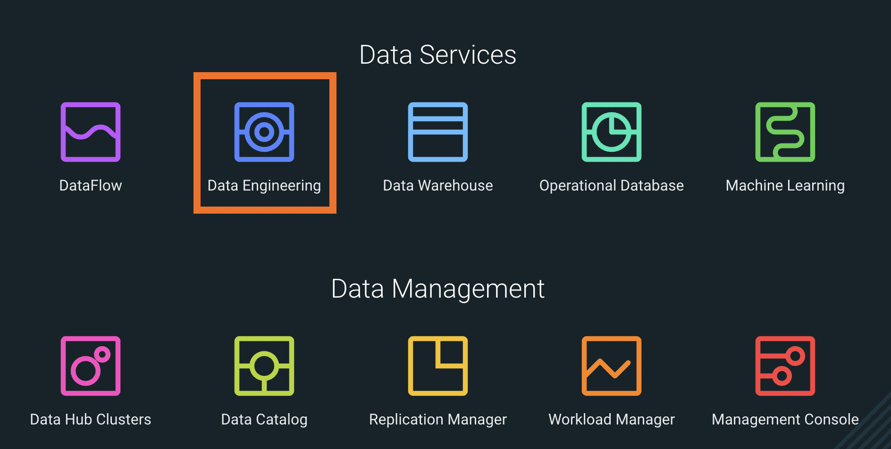
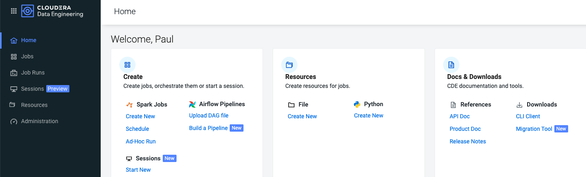
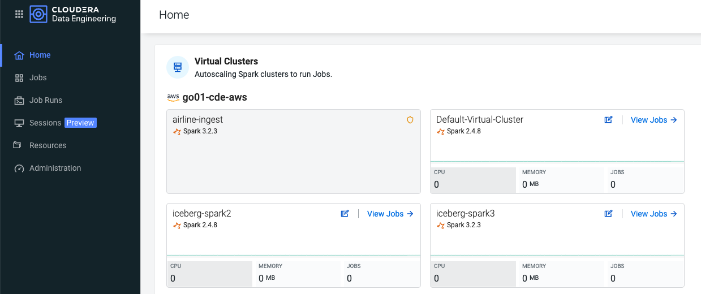
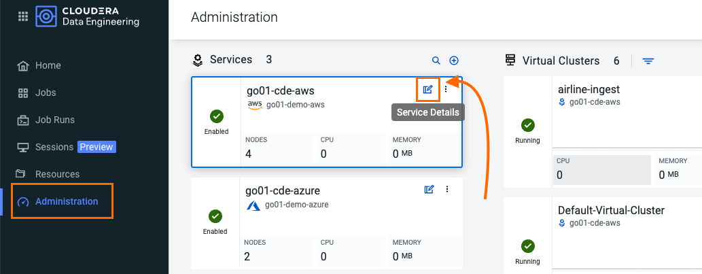
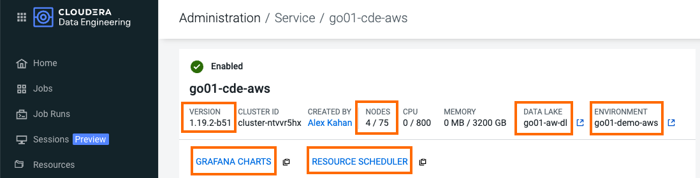
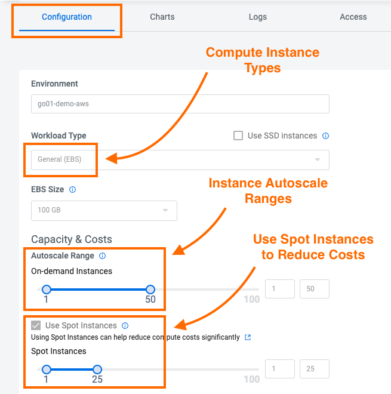
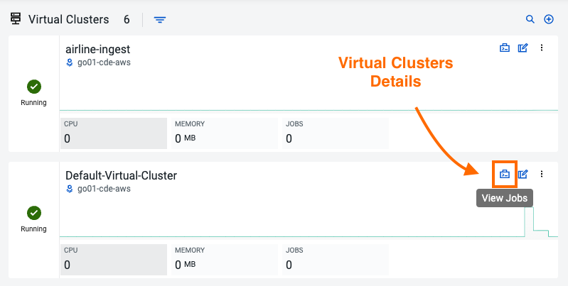
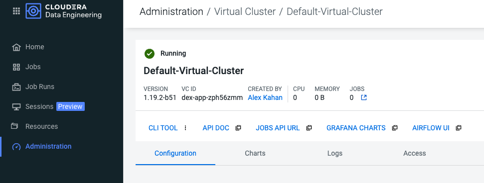
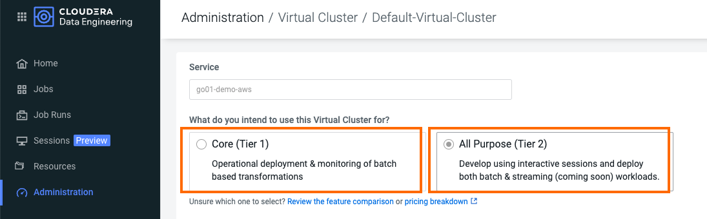
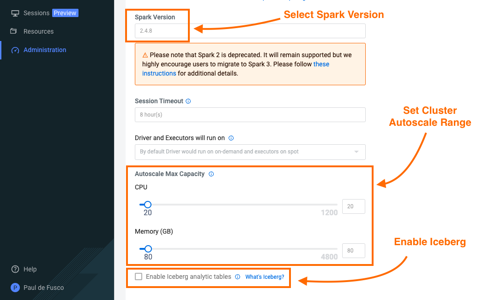

# Architecture CDE

## Objectif

Dans cette section, vous découvrirez l'architecture flexible de CDE et ses principaux composants.

## Table des matières

* [Introduction au Service CDE](https://github.com/pdefusco/CDE_124_HOL/blob/main/step_by_step_guides/english/01-architecture.md#introduction-to-the-cde-service)
  * [Environnement CDP](https://github.com/pdefusco/CDE_124_HOL/blob/main/step_by_step_guides/english/01-architecture.md#cdp-environment)
  * [Service CDE](https://github.com/pdefusco/CDE_124_HOL/blob/main/step_by_step_guides/english/01-architecture.md#cde-service)
  * [Cluster Virtuel](https://github.com/pdefusco/CDE_124_HOL/blob/main/step_by_step_guides/english/01-architecture.md#cde-virtual-cluster)
  * [Jobs CDE](https://github.com/pdefusco/CDE_124_HOL/blob/main/step_by_step_guides/english/01-architecture.md#jobs)
  * [Ressource CDE](https://github.com/pdefusco/CDE_124_HOL/blob/main/step_by_step_guides/english/01-architecture.md#resource)
  * [Exécution de Job](https://github.com/pdefusco/CDE_124_HOL/blob/main/step_by_step_guides/english/01-architecture.md#job-run)
  * [Sessions CDE](https://github.com/pdefusco/CDE_124_HOL/blob/main/step_by_step_guides/english/01-architecture.md#cde-session)
  * [Apache Iceberg](https://github.com/pdefusco/CDE_124_HOL/blob/main/step_by_step_guides/english/01-architecture.md#apache-iceberg)
  * [Interface Utilisateur CDE](https://github.com/pdefusco/CDE_124_HOL/blob/main/step_by_step_guides/english/01-architecture.md#cde-user-interface)
* [Résumé](https://github.com/pdefusco/CDE_124_HOL/blob/main/step_by_step_guides/english/01-architecture.md#summary)

## Introduction au Service CDE

Cloudera Data Engineering (CDE) est un service pour Cloudera Data Platform qui vous permet de soumettre des jobs batch à des clusters virtuels à mise à l'échelle automatique. CDE vous permet de passer plus de temps sur vos applications et moins de temps sur l'infrastructure.

Cloudera Data Engineering vous permet de créer, gérer et planifier des jobs Apache Spark sans la charge de créer et de maintenir des clusters Spark. Avec Cloudera Data Engineering, vous définissez des clusters virtuels avec une plage de ressources CPU et mémoire, et le cluster se met à l'échelle en fonction des besoins pour exécuter vos charges de travail Spark, ce qui aide à contrôler vos coûts cloud.

Le service CDE est accessible depuis la page d'accueil CDP en cliquant sur l'icône bleue "Data Engineering".

La page d'accueil CDE vous permet d'accéder, de créer et de gérer les services CDE et les clusters virtuels. Au sein de chaque service CDE, vous pouvez déployer un ou plusieurs clusters virtuels CDE. Dans le cluster virtuel, vous pouvez créer, surveiller et dépanner des jobs Spark et Airflow.

Le service CDE est lié à l'environnement CDP. Chaque service CDE est associé à au plus un environnement CDP, tandis qu'un environnement CDP peut être associé à un ou plusieurs services CDE.

Voici les composants les plus importants du service CDE :

##### Environnement CDP
Un sous-ensemble logique de votre compte fournisseur cloud, incluant un réseau virtuel spécifique. Les environnements CDP peuvent être hébergés sur AWS, Azure, RedHat OCP et Cloudera ECS. Pour plus d'informations, consultez [Environnements CDP](https://docs.cloudera.com/management-console/cloud/overview/topics/mc-core-concepts.html). En pratique, un environnement équivaut à un Data Lake, car chaque environnement est automatiquement associé à ses propres services SDX pour la sécurité, la gouvernance et le lignage.

##### Service CDE
Le cluster Kubernetes de longue durée et les services qui gèrent les clusters virtuels CDE. Le service CDE doit être activé sur un environnement avant que vous puissiez créer des clusters virtuels CDE.

##### Cluster Virtuel CDE
Un cluster individuel à mise à l'échelle automatique avec des plages de CPU et de mémoire prédéfinies. Les clusters virtuels dans CDE peuvent être créés et supprimés à la demande. Les jobs sont associés aux clusters. Lors du déploiement d'un cluster virtuel, vous pouvez choisir entre deux niveaux de cluster :

*Core (Niveau 1)* : Les options de transformation et d'ingénierie basées sur le batch incluent :
* Cluster à mise à l'échelle automatique
* Instances Spot
* SDX/Lakehouse
* Cycle de vie des jobs
* Surveillance
* Orchestration de workflows

*All Purpose (Niveau 2)* : Développez en utilisant des sessions interactives et déployez à la fois des charges de travail batch et streaming. Cette option inclut toutes les options du Niveau 1, avec en plus :
* Sessions Shell - CLI et Web
* JDBC/SparkSQL (Disponible en octobre 2023 avec CDE 1.20)
* IDE (Disponible en octobre 2023 avec CDE 1.20)

Les clusters Core sont recommandés comme environnements de production. Les clusters All Purpose sont quant à eux conçus pour être utilisés comme environnements de développement et de test.
Pour plus d'informations sur la version CDE 1.23, veuillez consulter cette page dans la [documentation](https://docs.cloudera.com/data-engineering/cloud/release-notes/topics/cde-whats-new-1.23.0.html).

##### Jobs
Code applicatif accompagné de configurations et de ressources définies. Les jobs peuvent être exécutés à la demande ou planifiés. Une exécution individuelle d'un job est appelée une exécution de job (job run).

##### Ressource
Un ensemble défini de fichiers, tels qu'un fichier Python ou un JAR applicatif, des dépendances et tout autre fichier de référence requis pour un job.

##### Exécution de Job
Une exécution individuelle d'un job.

##### Session CDE

Les sessions interactives CDE offrent aux data engineers des points d'accès flexibles pour commencer à développer des applications Spark depuis n'importe où — dans un terminal web, une CLI locale, l'IDE de votre choix, et même via JDBC depuis des outils tiers.

##### Apache Iceberg

Apache Iceberg est un format de table ouvert, cloud-native et haute performance, permettant d'organiser des ensembles de données analytiques à l'échelle du pétaoctet sur un système de fichiers ou un stockage objet. Combiné avec Cloudera Data Platform (CDP), il permet aux utilisateurs de construire une architecture de data lakehouse ouverte pour des analyses multifonctions et de déployer des pipelines de bout en bout à grande échelle.

L'Open Data Lakehouse sur CDP simplifie l'analyse avancée sur toutes les données avec une plateforme unifiée pour les données structurées et non structurées, et des services de données intégrés pour permettre tout cas d'usage analytique : ML, BI, stream analytics et analyses en temps réel. Apache Iceberg est la clé secrète du lakehouse ouvert.

Iceberg est compatible avec une variété de moteurs de calcul, y compris Spark. CDE vous permet de déployer des clusters virtuels compatibles Iceberg.

Pour plus d'informations, veuillez consulter la [documentation](https://iceberg.apache.org/).

##### Interface Utilisateur CDE

Maintenant que vous avez couvert les bases de CDE, prenez quelques instants pour vous familiariser avec la page d'accueil CDE.

La page d'accueil offre une vue d'ensemble de haut niveau de tous les services et clusters CDE. En haut, vous disposez de raccourcis pour créer des jobs et des ressources CDE.

Faites défiler jusqu'à la section des clusters virtuels CDE et notez que tous les clusters virtuels et chaque environnement CDP / service CDE associé sont affichés.

Ensuite, ouvrez la page Administration dans l'onglet de gauche. Cette page affiche également les services CDE à gauche et les clusters virtuels associés à droite.

Ouvrez la page des détails du service CDE et notez les informations clés et les liens suivants :

* Version CDE
* Plage de mise à l'échelle automatique des nœuds
* Data Lake et environnement CDP
* Graphiques Graphana. Cliquez sur ce lien pour obtenir un tableau de bord des ressources Kubernetes en cours d'exécution.
* Planificateur de ressources. Cliquez sur ce lien pour afficher l'interface Web YuniKorn.

Faites défiler et ouvrez l'onglet Configurations. Notez que c'est ici que sont définis les types d'instances et les plages de mise à l'échelle automatique des instances.

Pour en savoir plus sur d'autres configurations importantes du service, consultez [Activation d'un service CDE](https://docs.cloudera.com/data-engineering/cloud/enable-data-engineering/topics/cde-enable-data-engineering.html) dans la documentation CDE.

Retournez à la page Administration et ouvrez la page des détails d'un cluster virtuel.

Cette vue inclut d'autres informations importantes de gestion du cluster. À partir d'ici, vous pouvez :

* Télécharger les binaires du CDE CLI. La CLI est recommandée pour soumettre des jobs et interagir avec CDE. Elle est abordée dans la partie 3 de ce guide.
* Consulter la documentation de l'API pour découvrir l'API CDE et construire des exemples de requêtes sur la page Swagger.
* Accéder à l'interface Airflow pour surveiller vos jobs Airflow, configurer des connexions et variables personnalisées, et plus encore.

Ouvrez l'onglet Configuration. Notez que vous pouvez choisir entre les clusters de niveau Core et All Purpose.
De plus, cette vue fournit des options pour définir les plages de mise à l'échelle automatique du CPU et de la mémoire, la version de Spark et les options Iceberg.
CDE prend en charge Spark 3.5.1.

Pour en savoir plus sur l'architecture CDE, veuillez consulter [Créer et Gérer des Clusters Virtuels](https://docs.cloudera.com/data-engineering/cloud/manage-clusters/topics/cde-create-cluster.html) et [Recommandations pour le dimensionnement des déploiements CDE](https://docs.cloudera.com/data-engineering/cloud/deployment-architecture/topics/cde-general-scaling.html)

## Résumé

Un service CDE définit les types d'instances de calcul, les plages de mise à l'échelle automatique des instances et le Data Lake CDP associé. Les données et les utilisateurs associés au service sont soumis à SDX et aux paramètres de l'environnement CDP. Vous pouvez tirer parti de SDX Atlas et Ranger pour visualiser les métadonnées des tables et des jobs, et sécuriser l'accès aux utilisateurs et aux données avec des politiques fines.

Au sein d'un service CDE, vous pouvez déployer un ou plusieurs clusters virtuels CDE. La plage de mise à l'échelle automatique du service correspond au nombre min/max d'instances de calcul autorisées. La plage de mise à l'échelle automatique du cluster virtuel correspond aux ressources CPU et mémoire min/max pouvant être utilisées par tous les jobs CDE au sein du cluster. La plage de mise à l'échelle automatique du cluster virtuel est naturellement limitée par le CPU et la mémoire disponibles au niveau du service.

CDE prend en charge la version Spark 3.5.1. Les clusters virtuels CDE sont déployés avec une seule version de Spark par cluster virtuel.

Cette architecture flexible vous permet d'isoler vos charges de travail et de limiter les accès entre différents clusters de calcul à mise à l'échelle automatique, tout en prédéfinissant des garde-fous de gestion des coûts au niveau agrégé. Par exemple, vous pouvez définir des services au niveau organisationnel et des clusters virtuels au sein de ceux-ci en tant que DEV, QA, PROD, etc.

CDE tire parti de la planification des ressources et des politiques de tri de YuniKorn, telles que le gang scheduling et le bin packing, pour optimiser l'utilisation des ressources et améliorer l'efficacité en termes de coûts. Pour plus d'informations sur le gang scheduling, consultez l'article de blog Cloudera [Spark on Kubernetes – Gang Scheduling with YuniKorn](https://blog.cloudera.com/spark-on-kubernetes-gang-scheduling-with-yunikorn/).

La mise à l'échelle automatique des jobs Spark CDE est contrôlée par l'allocation dynamique d'Apache Spark. L'allocation dynamique augmente et réduit le nombre d'exécuteurs de jobs selon les besoins pour les jobs en cours d'exécution. Cela peut apporter d'importants gains de performance en allouant autant de ressources que nécessaire au job en cours d'exécution, et en libérant les ressources lorsqu'elles ne sont plus nécessaires, afin que les jobs concurrents puissent potentiellement s'exécuter plus rapidement.
