# Développement d'Applications Spark dans CDE

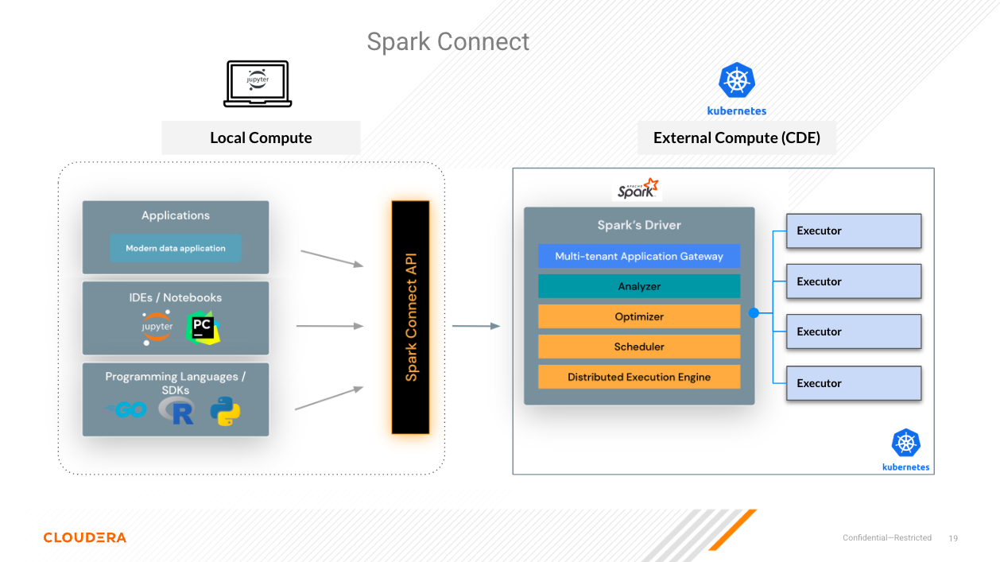

## Contenu

1. [Développement d'Applications Spark](https://github.com/pdefusco/CDE_124_HOL/blob/main/step_by_step_guides/english/02-development.md#lab-1-spark-application-development).
2. [Dépôts CDE, Jobs et Surveillance](https://github.com/pdefusco/CDE_124_HOL/blob/main/step_by_step_guides/english/02-development.md#lab-2-cde-repositories-jobs-and-monitoring).

Nous allons prototyper et tester les opérations Iceberg Merge Into et Incremental Read.

## Lab 1. Développement d'Applications Spark

#### Récupérer le conteneur Docker et lancer l'IDE

Clonez le dépôt GitHub sur votre machine locale.

```
git clone https://github.com/pdefusco/CDE_124_HOL.git
cd CDE_124_HOL
```

Lancez le conteneur Docker.

```
docker run -p 8888:8888 pauldefusco/cde_124_hol
```

Lancez l'IDE JupyterLab dans votre navigateur en copiant-collant l'URL fournie comme indiqué ci-dessous.

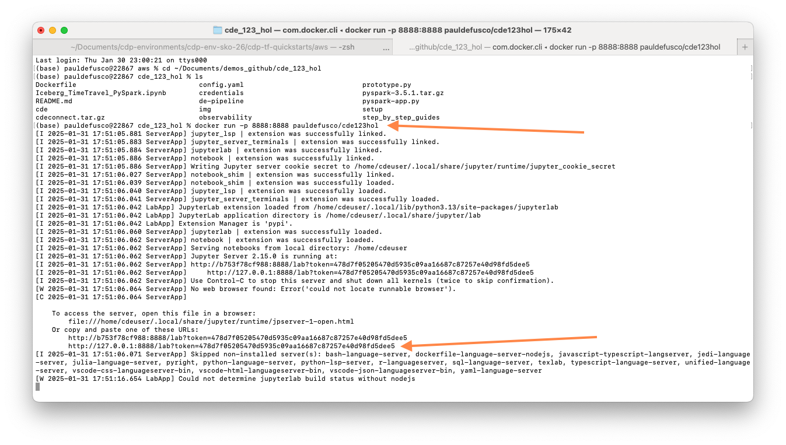

Vous avez maintenant accès à tous les supports du lab depuis l'IDE JupyterLab dans le volet de gauche. De là, vous pouvez lancer des notebooks et ouvrir le terminal.

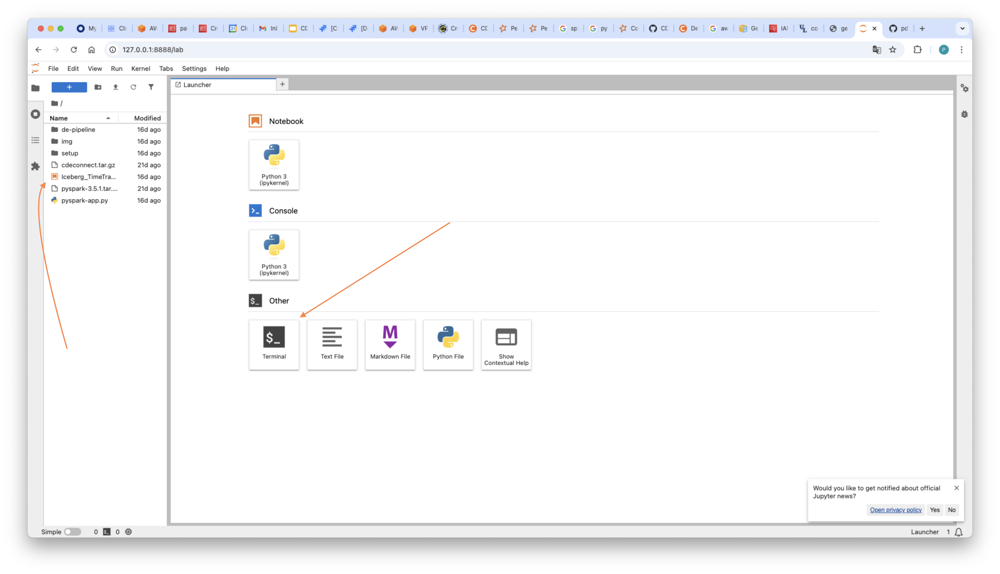

Vous utiliserez le terminal de l'IDE pour exécuter les commandes CDE CLI des labs. Vous devez d'abord configurer la CLI et installer Spark Connect.

#### Configurer le CDE CLI et installer Spark Connect pour CDE

Ouvrez les configurations CDE et appliquez votre Workload Username et l'URL de l'API Jobs. Vous trouverez votre URL de l'API Jobs sur la page des détails de votre cluster virtuel.

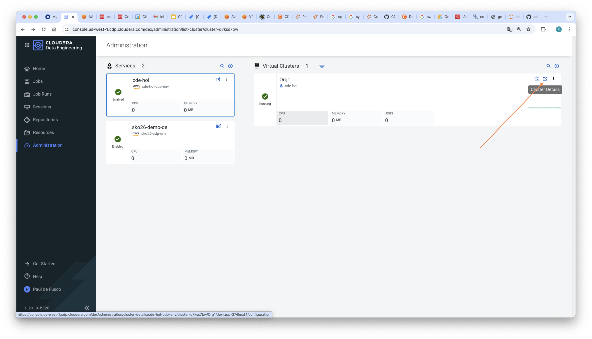

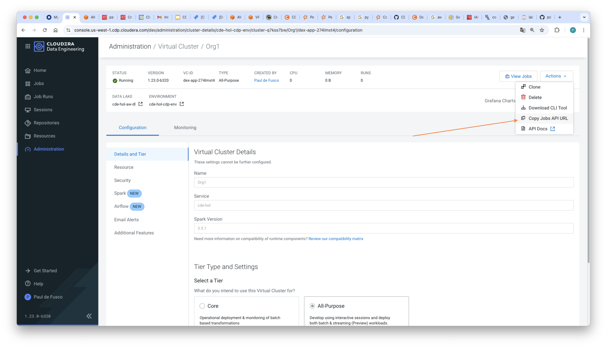

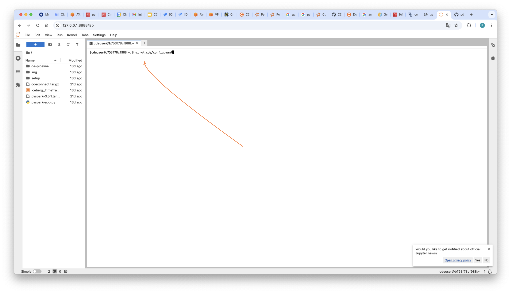

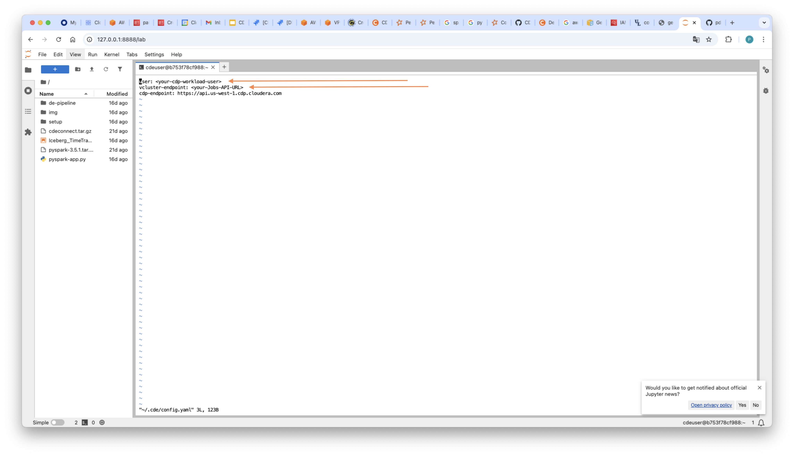

Ensuite, générez un jeton d'accès CDP et modifiez vos identifiants CDP.

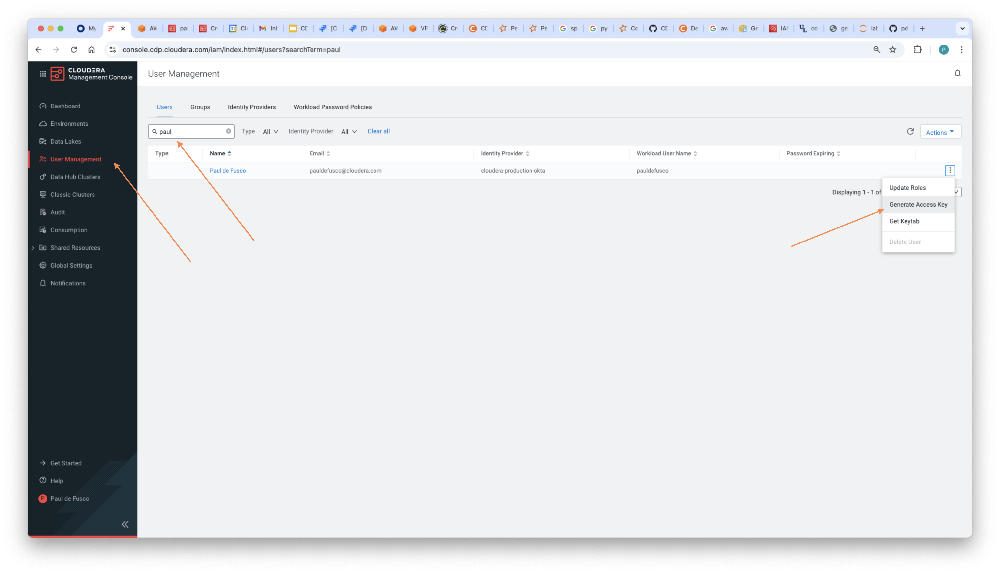

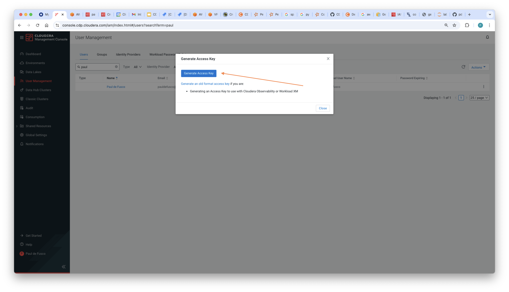

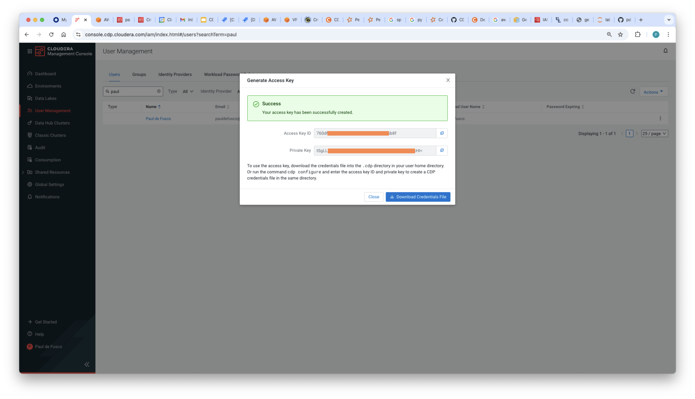

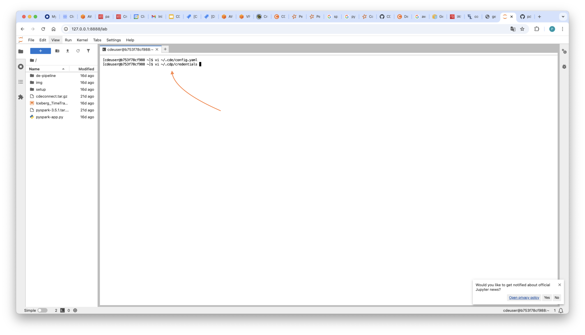

Enfin, exécutez les commandes suivantes pour installer les tarballs CDE Spark Connect.

```
pip3 install cdeconnect.tar.gz  
pip3 install pyspark-3.5.1.tar.gz
```

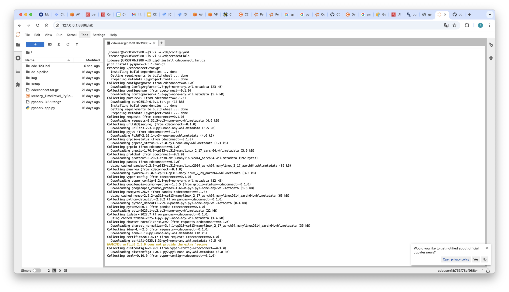

#### Lancer une session CDE Spark Connect

Démarrez une session CDE de type Spark Connect. Modifiez le paramètre Session Name afin qu'il n'entre pas en collision avec les sessions d'autres utilisateurs. Vous serez invité à saisir votre Workload Password. C'est le même mot de passe que celui que vous avez utilisé pour vous connecter à CDP.

```
cde session create \
  --name paul-hol-session \
  --type spark-connect \
  --num-executors 2 \
  --driver-cores 2 \
  --driver-memory "2g" \
  --executor-cores 2 \
  --executor-memory "2g"
```

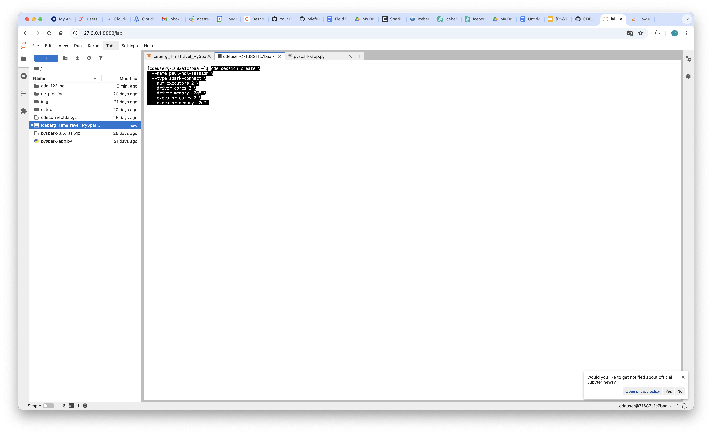

Dans l'interface Sessions, vérifiez que la session est en cours d'exécution.

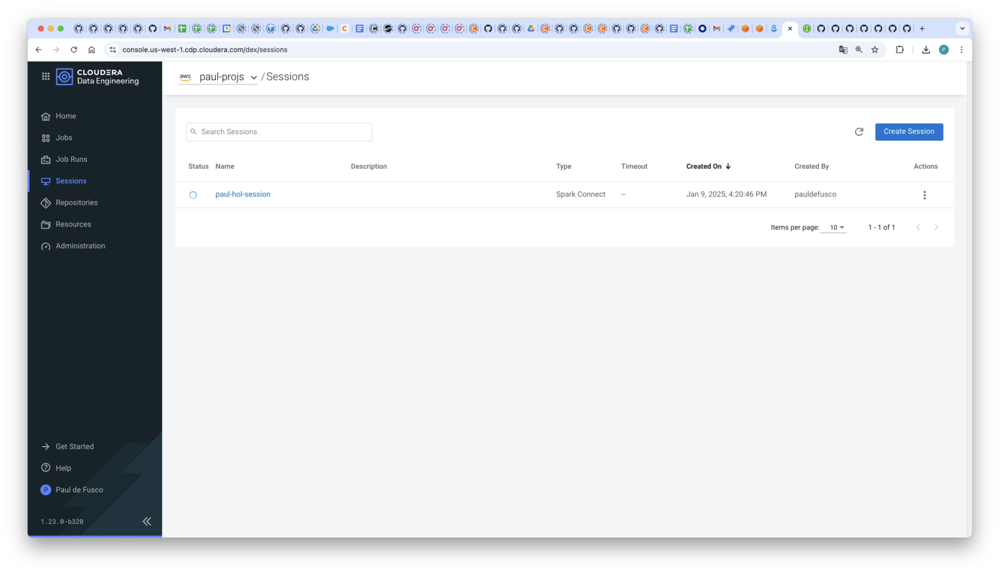

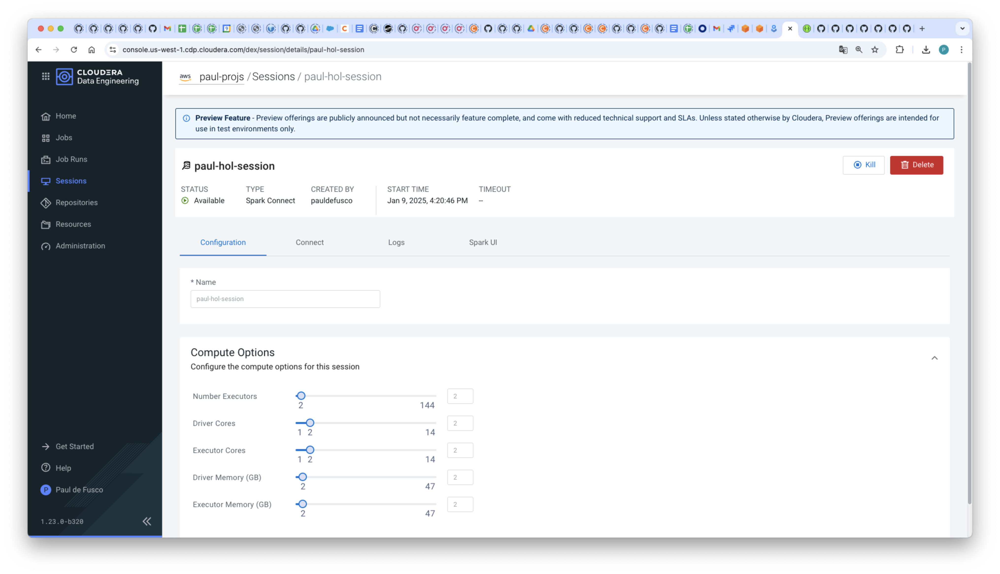

#### Exécuter votre première application PySpark et Iceberg via Spark Connect

Vous êtes maintenant prêt à vous connecter à la session CDE depuis votre IDE JupyterLab local en utilisant Spark Connect.

Ouvrez Iceberg_TimeTravel_PySpark.ipynb. Mettez à jour les variables du nom de la session Spark Connect, du nom d'utilisateur et de l'emplacement de stockage dans les deux premières cellules. Puis exécutez chaque cellule du notebook.

```
from cde import CDESparkConnectSession
spark = CDESparkConnectSession.builder.sessionName('<your-spark-connect-session-name-here>').get()
```

```
storageLocation = <your-storage-location-here>
username = <your-cdp-workload-username-here>
```

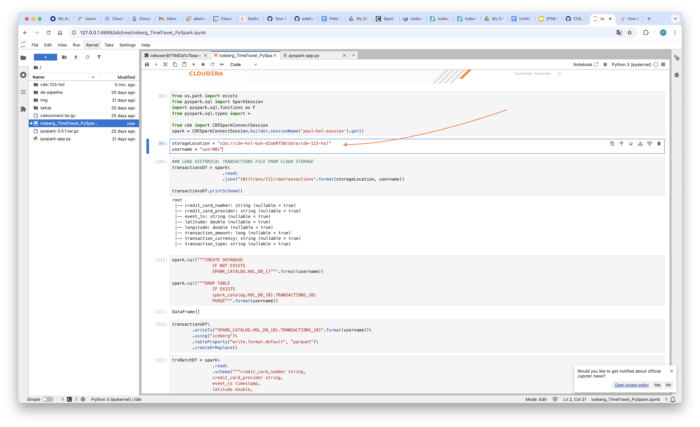

#### Prototyper l'application Spark et Iceberg en tant que Spark Submit

Dans votre terminal, exécutez les commandes suivantes pour lancer votre code en tant que Spark Submit. Assurez-vous de modifier l'option "vcluster-endpoint" en fonction de l'URL de l'API Jobs de votre cluster virtuel.

```
cde spark submit \
  pyspark-app.py \
  --vcluster-endpoint <your-DEV-vc-jobs-api-url-here> \
  --executor-memory "4g" \
  --executor-cores 2 \
  <your-storage-location-here> \
  <your-hol-username-here>
```

Par exemple :

```
cde spark submit \
  pyspark-app.py \
  --vcluster-endpoint https://tgsn9958.cde-qngfhb5x.pdf-aw-c.a465-9q4k.cloudera.site/dex/api/v1 \
  --executor-memory "4g" \
  --executor-cores 2 \
  s3a://pdf-aw-buk-aec7c095/data/cde-demo/bank/20251210 \
  user001
```

Attendez que l'application s'exécute et validez les résultats dans le terminal.

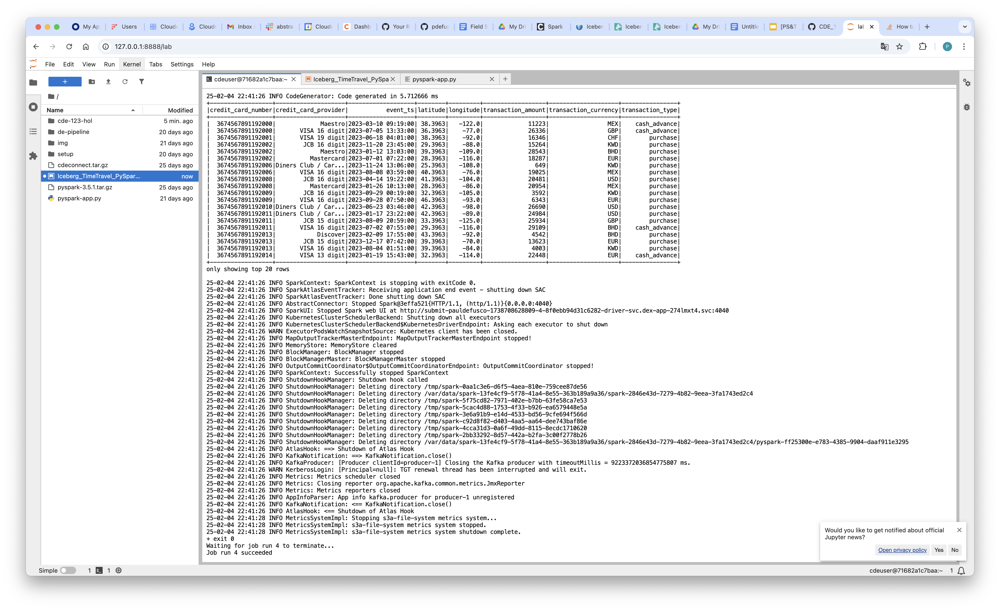

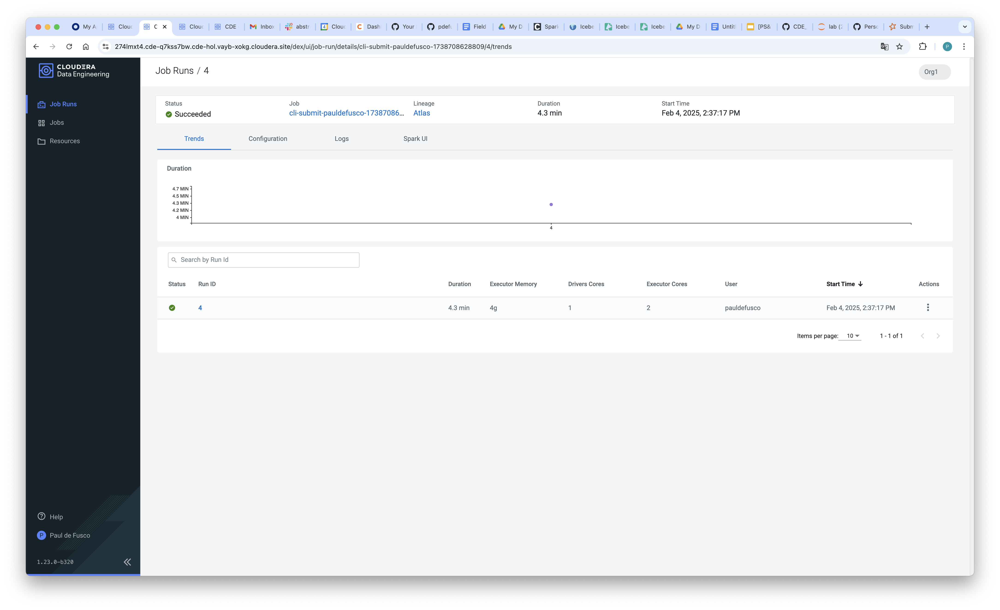

Vous êtes maintenant prêt à convertir le Spark Submit en un job Spark CDE.

## Lab 2. Dépôts CDE, Jobs et Surveillance

Les dépôts CDE (CDE Repositories) sont utilisés pour importer des fichiers et des dépendances dans les clusters virtuels en clonant des dépôts git. Créez votre dépôt CDE et synchronisez-le avec le dépôt Git. Assurez-vous de mettre à jour les paramètres name et vcluster-endpoint avant d'exécuter les commandes CLI.

```
cde repository create --name sparkAppRepoDevUser001 \
  --branch main \
  --url https://github.com/pdefusco/CDE_124_HOL.git \
  --vcluster-endpoint <your-DEV-vc-jobs-api-url-here>
```

```
cde repository sync --name sparkAppRepoDevUser001 \
  --vcluster-endpoint <your-DEV-vc-jobs-api-url-here>
```

Par exemple :

```
cde repository create --name sparkAppRepoDevUser001 \
  --branch main \
  --url https://github.com/pdefusco/CDE_124_HOL.git \
  --vcluster-endpoint https://tgsn9958.cde-qngfhb5x.pdf-aw-c.a465-9q4k.cloudera.site/dex/api/v1
```

```
cde repository sync --name sparkAppRepoDevUser001 \
  --vcluster-endpoint https://tgsn9958.cde-qngfhb5x.pdf-aw-c.a465-9q4k.cloudera.site/dex/api/v1
```

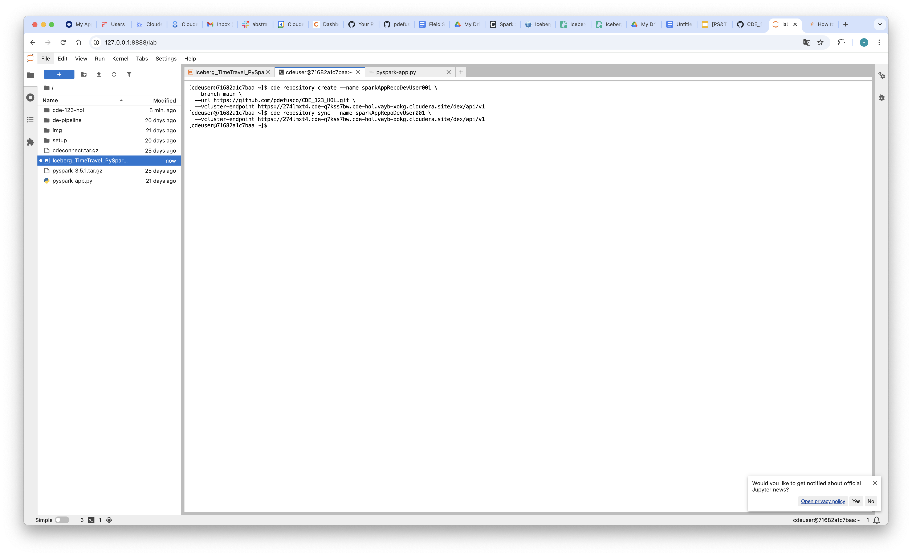

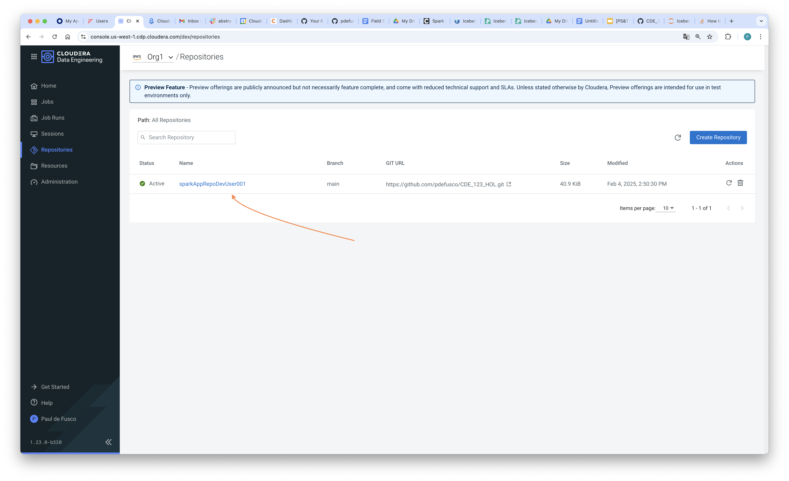

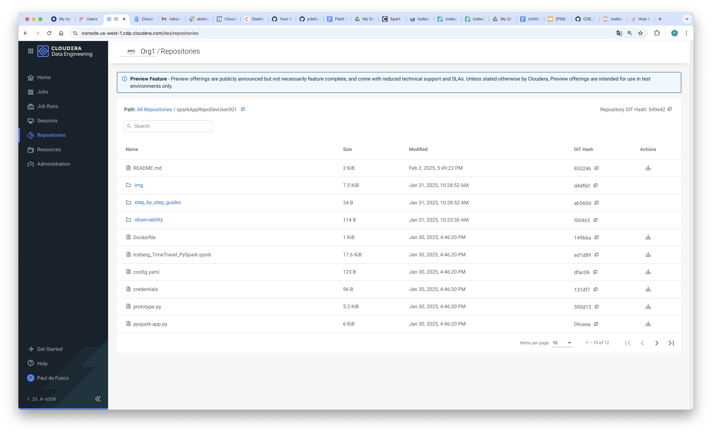

#### Déployer avec la CLI

Créez maintenant un job Spark CDE en utilisant le dépôt CDE comme dépendance.

Les fichiers du dépôt sont montés et accessibles par l'application au moment de l'exécution.

Avant d'exécuter les commandes CLI, mettez à jour les options name, resource et vcluster endpoint en fonction du nom d'utilisateur qui vous a été attribué.

```
cde job create --name cde_spark_iceberg_job_user001 \
  --type spark \
  --mount-1-resource sparkAppRepoDevUser001 \
  --executor-cores 2 \
  --executor-memory "4g" \
  --application-file pyspark-app.py\
  --vcluster-endpoint <your-DEV-vc-jobs-api-url-here> \
  --arg <your-storage-location-here> \
  --arg <your-hol-username-here>
```

```
cde job run --name cde_spark_iceberg_job_user001 \
  --executor-cores 4 \
  --executor-memory "2g" \
  --vcluster-endpoint <your-DEV-vc-jobs-api-url-here>
```

Par exemple :

```
cde job create --name cde_spark_iceberg_job_user001 \
  --type spark \
  --mount-1-resource sparkAppRepoDevUser001 \
  --executor-cores 2 \
  --executor-memory "4g" \
  --application-file pyspark-app.py\
  --vcluster-endpoint https://tgsn9958.cde-qngfhb5x.pdf-aw-c.a465-9q4k.cloudera.site/dex/api/v1 \
  --arg s3a://pdf-aw-buk-aec7c095/data/cde-demo/bank/20251210 \
  --arg user001
```

```
cde job run --name cde_spark_iceberg_job_user001 \
  --executor-cores 4 \
  --executor-memory "2g" \
  --vcluster-endpoint https://tgsn9958.cde-qngfhb5x.pdf-aw-c.a465-9q4k.cloudera.site/dex/api/v1
```

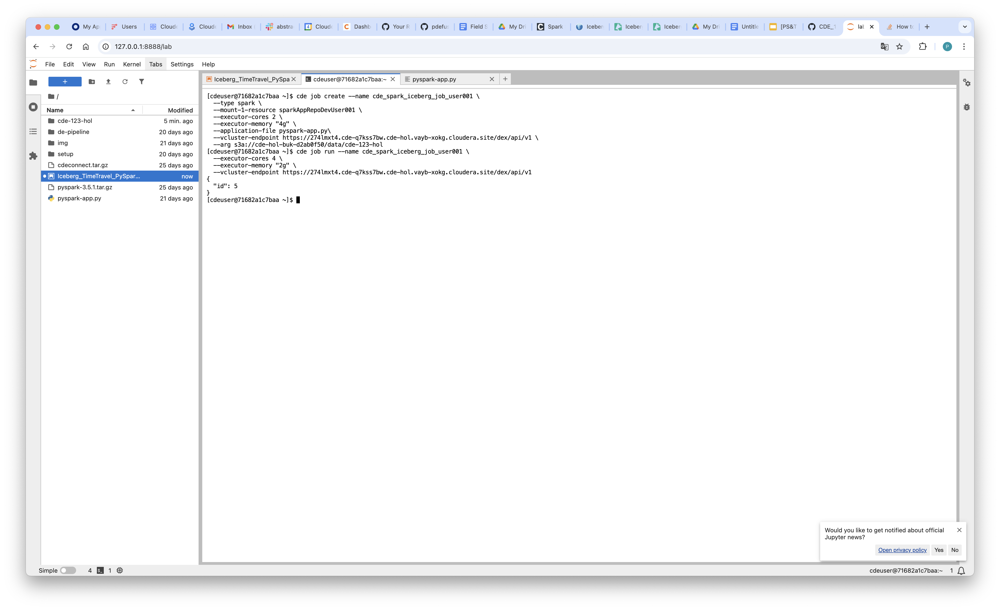


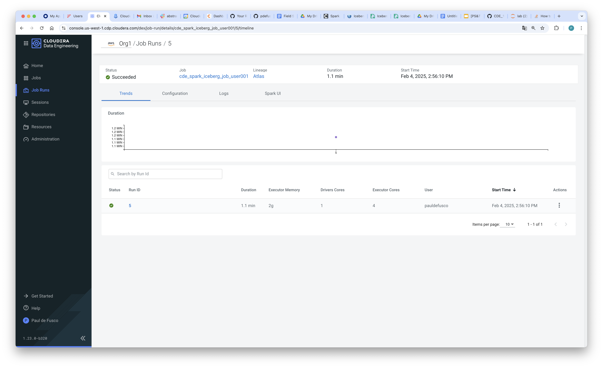

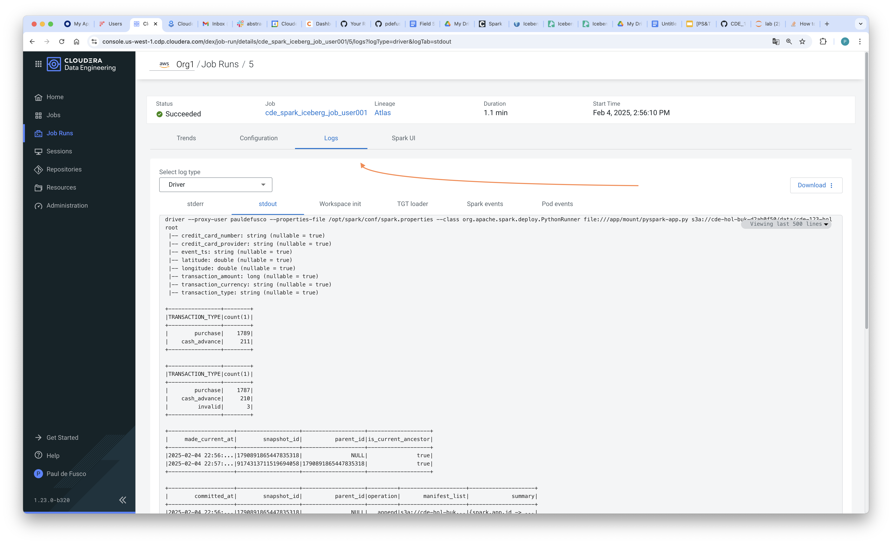

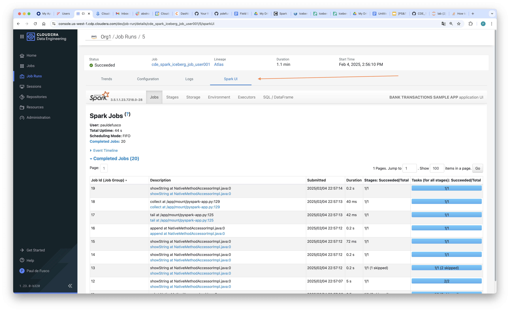

####  Surveiller

Rendez-vous dans l'interface des exécutions de jobs / exécutez quelques commandes CDE CLI pour vérifier le statut.

```
# List all Jobs in the Virtual Cluster:
cde job list \
  --vcluster-endpoint <your-DEV-vc-jobs-api-url-here>
```

Par exemple :

```
# List all Jobs in the Virtual Cluster:
cde job list \
  --vcluster-endpoint https://tgsn9958.cde-qngfhb5x.pdf-aw-c.a465-9q4k.cloudera.site/dex/api/v1
```

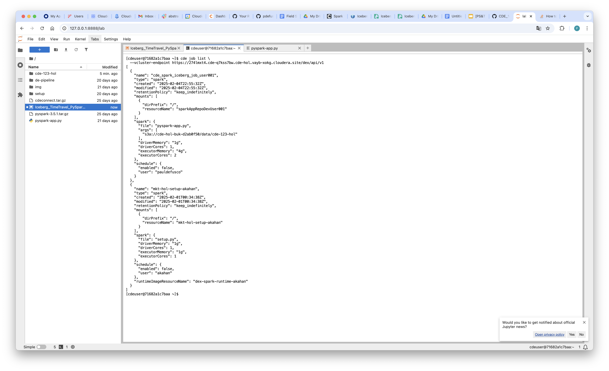

```
# List all jobs in the Virtual Cluster whose name is "cde_spark_job_user001":
cde job list \
  --filter 'name[eq]cde_spark_iceberg_job_user001' \
  --vcluster-endpoint <your-DEV-vc-jobs-api-url-here>
```

```
# List all jobs in the Virtual Cluster whose job application file name equals "pyspark-app.py":
cde job list \
  --filter 'spark.file[eq]pyspark-app.py' \
  --vcluster-endpoint <your-DEV-vc-jobs-api-url-here>
```

Par exemple :

```
# List all jobs in the Virtual Cluster whose name is "cde_spark_job_user001":
cde job list \
  --filter 'name[eq]cde_spark_iceberg_job_user001' \
  --vcluster-endpoint https://tgsn9958.cde-qngfhb5x.pdf-aw-c.a465-9q4k.cloudera.site/dex/api/v1
```

```
# List all jobs in the Virtual Cluster whose job application file name equals "pyspark-app.py":
cde job list \
  --filter 'spark.file[eq]pyspark-app.py' \
  --vcluster-endpoint https://tgsn9958.cde-qngfhb5x.pdf-aw-c.a465-9q4k.cloudera.site/dex/api/v1
```

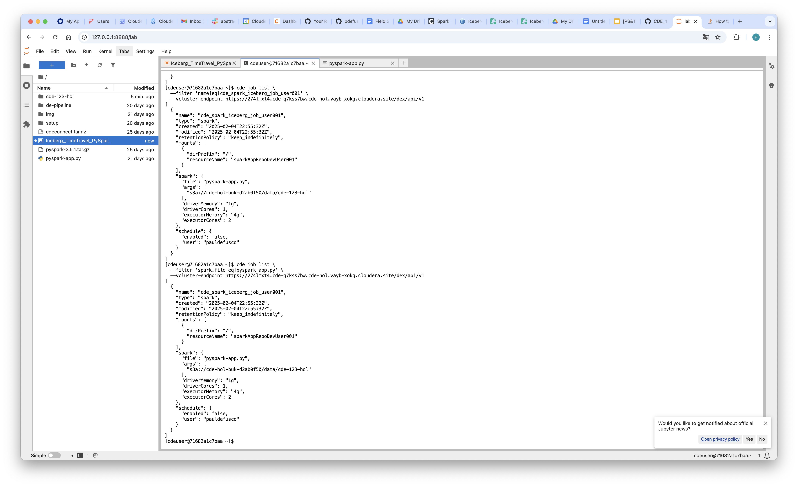

```
# List all runs for Job "cde_spark_job_user001":
cde run list \
  --filter 'job[eq]cde_spark_iceberg_job_user001' \
  --vcluster-endpoint <your-DEV-vc-jobs-api-url-here>
```

Par exemple :

```
# List all runs for Job "cde_spark_job_user001":
cde run list \
  --filter 'job[eq]cde_spark_iceberg_job_user001' \
  --vcluster-endpoint https://tgsn9958.cde-qngfhb5x.pdf-aw-c.a465-9q4k.cloudera.site/dex/api/v1
```

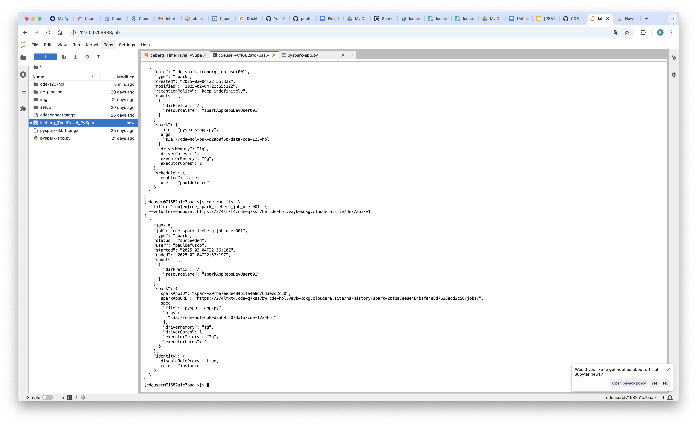

## Résumé et prochaines étapes

Une session Spark Connect est un type de session CDE qui expose l'interface Spark Connect. Une session Spark Connect vous permet de vous connecter à Spark depuis n'importe quel environnement Python distant.

Spark Connect vous permet de vous connecter à distance aux clusters Spark. Spark Connect est une API qui utilise la DataFrame API et des plans logiques non résolus comme protocole.

Dans cette section des labs, nous avons passé en revue un cadre de développement de bout en bout utilisant Spark Connect, le CDE CLI et Apache Iceberg. Vous pourriez également trouver les articles et démos suivants pertinents :

* [Installer le CDE CLI](https://docs.cloudera.com/data-engineering/cloud/cli-access/topics/cde-cli.html)
* [Introduction simple au CDE CLI](https://github.com/pdefusco/CDE_CLI_Simple)
* [Concepts CDE](https://docs.cloudera.com/data-engineering/cloud/cli-access/topics/cde-cli-concepts.html)
* [Référence des commandes CDE CLI](https://docs.cloudera.com/data-engineering/cloud/cli-access/topics/cde-cli-reference.html)
* [CDE Spark Connect](https://docs.cloudera.com/data-engineering/cloud/spark-connect-sessions/topics/cde-spark-connect-session.html)
* [Référence de l'API des Jobs CDE](https://docs.cloudera.com/data-engineering/cloud/jobs-rest-api-reference/index.html)
* [Utiliser Apache Iceberg dans CDE](https://docs.cloudera.com/data-engineering/cloud/manage-jobs/topics/cde-using-iceberg.html)
* [Comment créer une table Apache Iceberg dans CDE](https://community.cloudera.com/t5/Community-Articles/How-to-Create-an-Iceberg-Table-with-PySpark-in-Cloudera-Data/ta-p/394800)
