# Déploiement et Orchestration avec Airflow dans CDE

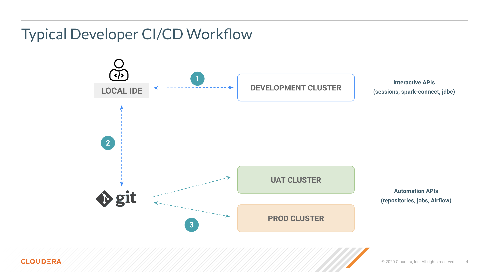

## Contenu

3. [Promouvoir vers un environnement supérieur en utilisant l'API en répliquant le dépôt et en redéployant](https://github.com/pdefusco/CDE_124_HOL/blob/main/step_by_step_guides/english/03-deployment.md#lab-3-promote-to-higher-env-using-api-by-replicating-repo-and-redeploy)
4. [Construire un pipeline d'orchestration avec Airflow](https://github.com/pdefusco/CDE_124_HOL/blob/main/step_by_step_guides/english/03-deployment.md#lab-4-build-orchestration-pipeline-with-airflow)

## Lab 3. Promouvoir vers un environnement supérieur en utilisant l'API en répliquant le dépôt et en redéployant

Maintenant que le job a réussi, déployez-le dans votre cluster PRD.

Créez et synchronisez le même dépôt Git depuis le cluster PRD. À partir de maintenant, exécutez les commandes CLI suivantes avec l'URL de l'API Jobs de votre cluster PRD comme paramètre vcluster-endpoint.

```
cde repository create \
  --name sparkAppRepoPrdUser001 \
  --branch main \
  --url https://github.com/pdefusco/CDE_124_HOL.git \
  --vcluster-endpoint <your-PRD-vc-jobs-api-url-here>
```

```
cde repository sync \
  --name sparkAppRepoPrdUser001 \
  --vcluster-endpoint <your-PRD-vc-jobs-api-url-here>
```

Par exemple :

```
cde repository create \
  --name sparkAppRepoPrdUser001 \
  --branch main \
  --url https://github.com/pdefusco/CDE_124_HOL.git \
  --vcluster-endpoint https://8wcx5dqp.cde-qngfhb5x.pdf-aw-c.a465-9q4k.cloudera.site/dex/api/v1
```

```
cde repository sync \
  --name sparkAppRepoPrdUser001 \
  --vcluster-endpoint https://8wcx5dqp.cde-qngfhb5x.pdf-aw-c.a465-9q4k.cloudera.site/dex/api/v1
```

Ensuite, créez un job Spark CDE en tirant parti du dépôt CDE comme dépendance.

```
cde job create --name cde_spark_job_prd_user001 \
  --type spark \
  --mount-1-resource sparkAppRepoPrdUser001 \
  --executor-cores 2 \
  --executor-memory "4g" \
  --application-file pyspark-app.py\
  --vcluster-endpoint <your-PRD-vc-jobs-api-url-here> \
  --arg <your-storage-location-here> \
  --arg <your-hol-username-here>
```

```
cde job run --name cde_spark_job_prd_user001 \
  --executor-cores 4 \
  --executor-memory "2g" \
  --vcluster-endpoint <your-PRD-vc-jobs-api-url-here>
```

Par exemple :

```
cde job create --name cde_spark_job_prd_user001 \
  --type spark \
  --mount-1-resource sparkAppRepoPrdUser001 \
  --executor-cores 2 \
  --executor-memory "4g" \
  --application-file pyspark-app.py\
  --vcluster-endpoint https://8wcx5dqp.cde-qngfhb5x.pdf-aw-c.a465-9q4k.cloudera.site/dex/api/v1 \
  --arg s3a://pdf-aw-buk-aec7c095/data/cde-demo/bank/20251210 \
  --arg user001
```

```
cde job run --name cde_spark_job_prd_user001 \
  --executor-cores 4 \
  --executor-memory "2g" \
  --vcluster-endpoint https://8wcx5dqp.cde-qngfhb5x.pdf-aw-c.a465-9q4k.cloudera.site/dex/api/v1
```

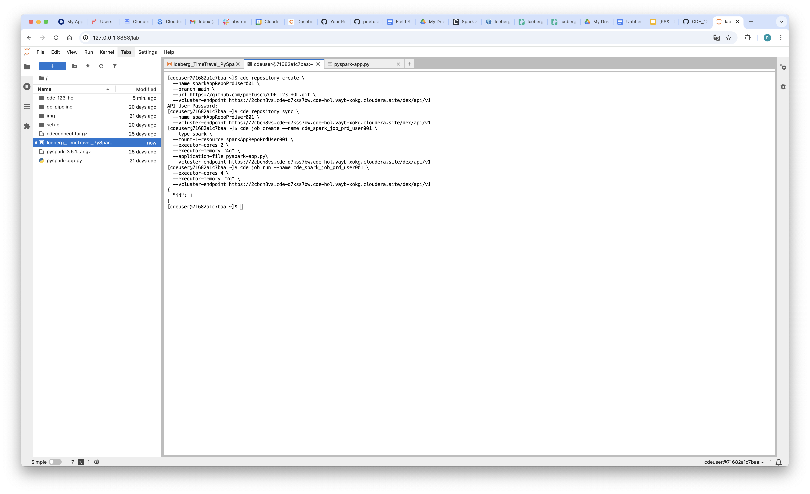

## Lab 4. Construire un pipeline d'orchestration avec Airflow

Créez les jobs Spark CDE. Notez que ceux-ci sont classés en Bronze, Silver et Gold, suivant une architecture de données Lakehouse.

```
cde job create --name cde_spark_job_bronze_user001 \
  --type spark \
  --arg <your-hol-username-here> \
  --arg <your-storage-location-here> \
  --mount-1-resource sparkAppRepoPrdUser001 \
  --python-env-resource-name Python-Env-Shared \
  --executor-cores 2 \
  --executor-memory "4g" \
  --application-file de-pipeline/spark/001_Lakehouse_Bronze.py\
  --vcluster-endpoint <your-PRD-vc-jobs-api-url-here>
```

```
cde job create --name cde_spark_job_silver_user001 \
  --type spark \
  --arg <your-hol-username-here> \
  --mount-1-resource sparkAppRepoPrdUser001 \
  --python-env-resource-name Python-Env-Shared \
  --executor-cores 2 \
  --executor-memory "4g" \
  --application-file de-pipeline/spark/002_Lakehouse_Silver.py\
  --vcluster-endpoint <your-PRD-vc-jobs-api-url-here>
```

```
cde job create --name cde_spark_job_gold_user001 \
  --type spark \
  --arg <your-hol-username-here> \
  --arg <your-storage-location-here> \
  --mount-1-resource sparkAppRepoPrdUser001 \
  --python-env-resource-name Python-Env-Shared \
  --executor-cores 2 \
  --executor-memory "4g" \
  --application-file de-pipeline/spark/003_Lakehouse_Gold.py\
  --vcluster-endpoint <your-PRD-vc-jobs-api-url-here>
```

Par exemple :

```
cde job create --name cde_spark_job_bronze_user001 \
  --type spark \
  --arg user001 \
  --arg s3a://pdf-aw-buk-aec7c095/data/cde-demo/bank/20251210 \
  --mount-1-resource sparkAppRepoPrdUser001 \
  --python-env-resource-name Python-Env-Shared \
  --executor-cores 2 \
  --executor-memory "4g" \
  --application-file de-pipeline-bank/spark/001_Lakehouse_Bronze.py\
  --vcluster-endpoint https://8wcx5dqp.cde-qngfhb5x.pdf-aw-c.a465-9q4k.cloudera.site/dex/api/v1
```

```
cde job create --name cde_spark_job_silver_user001 \
  --type spark \
  --arg user001 \
  --mount-1-resource sparkAppRepoPrdUser001 \
  --python-env-resource-name Python-Env-Shared \
  --executor-cores 2 \
  --executor-memory "4g" \
  --application-file de-pipeline-bank/spark/002_Lakehouse_Silver.py\
  --vcluster-endpoint https://8wcx5dqp.cde-qngfhb5x.pdf-aw-c.a465-9q4k.cloudera.site/dex/api/v1
```

```
cde job create --name cde_spark_job_gold_user001 \
  --type spark \
  --arg user001 \
  --arg s3a://pdf-aw-buk-aec7c095/data/cde-demo/bank/20251210 \
  --mount-1-resource sparkAppRepoPrdUser001 \
  --python-env-resource-name Python-Env-Shared \
  --executor-cores 2 \
  --executor-memory "4g" \
  --application-file de-pipeline-bank/spark/003_Lakehouse_Gold.py\
  --vcluster-endpoint https://8wcx5dqp.cde-qngfhb5x.pdf-aw-c.a465-9q4k.cloudera.site/dex/api/v1
```

Dans votre éditeur, ouvrez le DAG Airflow "004_airflow_dag_git" et modifiez votre variable de nom d'utilisateur à la ligne 54.

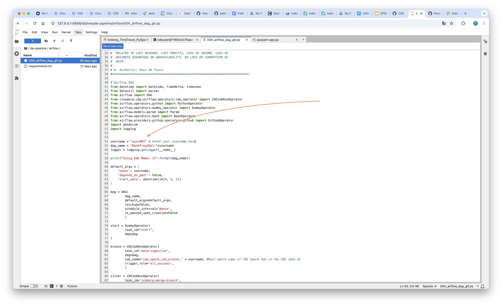

Créez ensuite le job Airflow CDE. Ce job orchestrera vos jobs Spark Lakehouse ci-dessus.

```
cde job create --name airflow-orchestration-user001 \
  --type airflow \
  --mount-1-resource sparkAppRepoPrdUser001 \
  --dag-file de-pipeline/airflow/004_airflow_dag_git.py\
  --vcluster-endpoint <your-PRD-vc-jobs-api-url-here>
```

Par exemple :

```
cde job create --name airflow-orchestration-user001 \
  --type airflow \
  --mount-1-resource sparkAppRepoPrdUser001 \
  --dag-file de-pipeline-bank/airflow/004_airflow_dag_git.py\
  --vcluster-endpoint https://8wcx5dqp.cde-qngfhb5x.pdf-aw-c.a465-9q4k.cloudera.site/dex/api/v1
```

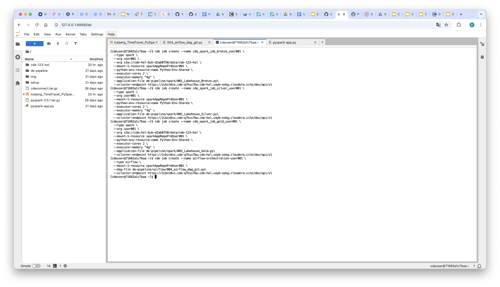

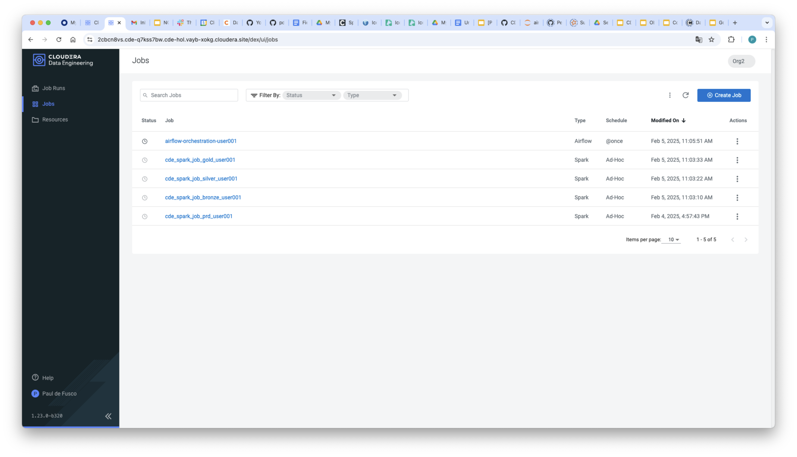

Il n'est pas nécessaire de déclencher manuellement l'exécution du job Airflow. Les paramètres du DAG incluent déjà une planification. Dès sa création, le job Airflow CDE s'exécutera peu après. Vous pouvez suivre son avancement dans l'interface des exécutions de jobs.

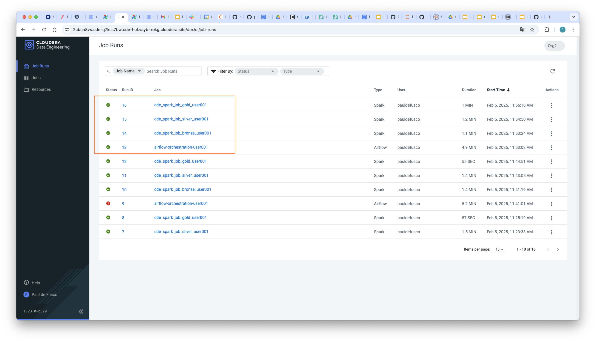

Vous pouvez utiliser l'interface Airflow pour inspecter vos pipelines. Depuis la page des détails du cluster virtuel, ouvrez l'interface Airflow, puis localisez votre DAG Airflow.

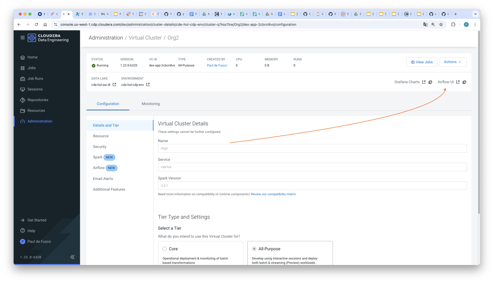

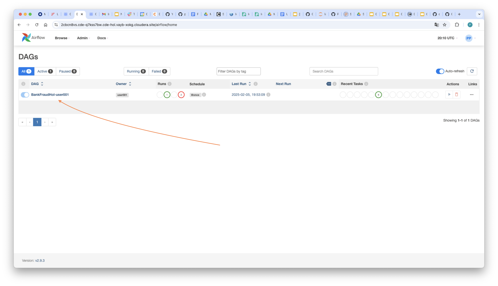

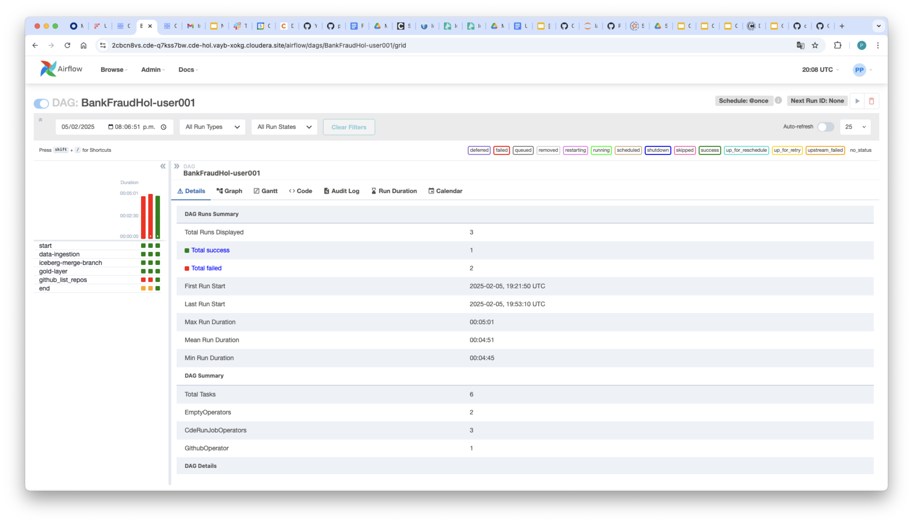

Airflow propose une variété de diagrammes, de graphiques et de visualisations pour surveiller vos exécutions à travers les tâches, les DAGs et les opérateurs. Lancez plusieurs fois votre DAG Airflow depuis l'interface des jobs CDE, puis revenez à l'interface Airflow pour inspecter vos tâches à travers différentes exécutions, et plus encore.

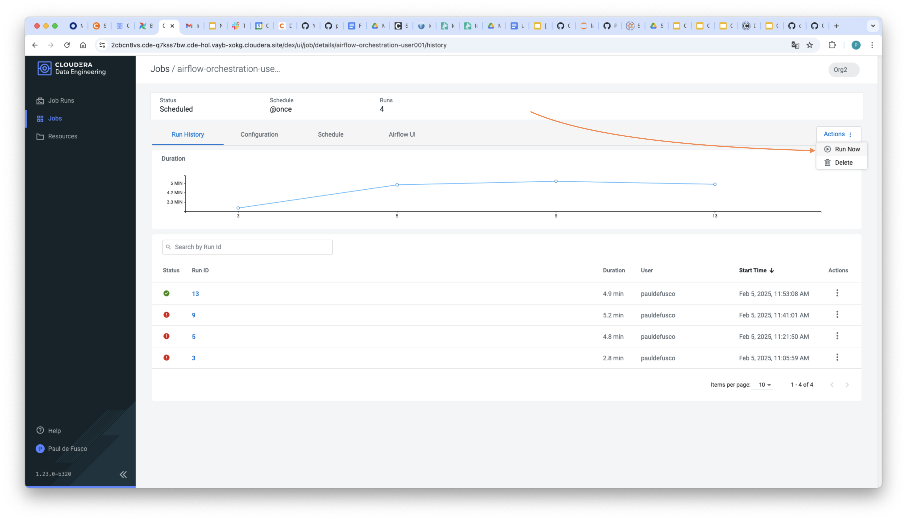

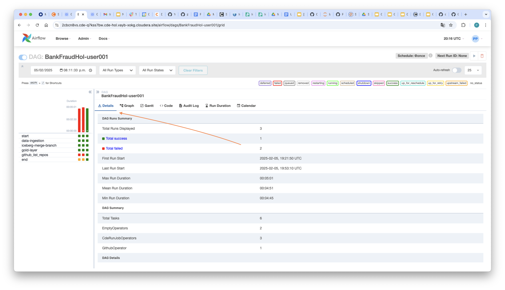

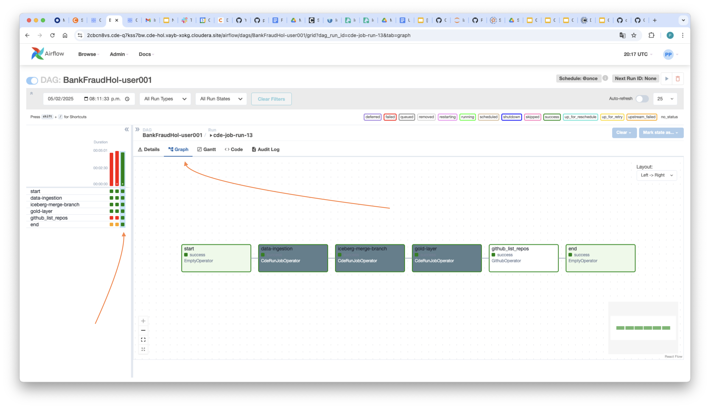

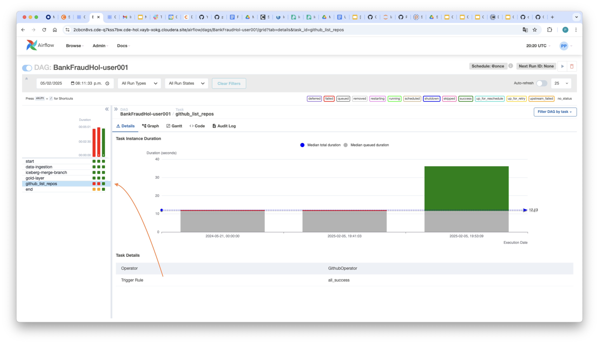

CDE Airflow prend en charge les fournisseurs tiers, c'est-à-dire des packages externes qui étendent les fonctionnalités d'Apache Airflow en ajoutant des intégrations avec d'autres systèmes, services et outils tels qu'AWS, Google Cloud, Microsoft Azure, des bases de données, des courtiers de messages et de nombreux autres services. Les providers sont open source et peuvent être installés séparément selon les besoins spécifiques d'un projet.

Sélectionnez la tâche GitHub List Repos, ouvrez les logs et notez que la sortie est fournie. Dans cette tâche particulière, vous avez utilisé l'opérateur GitHub pour lister les dépôts d'un compte GitHub.

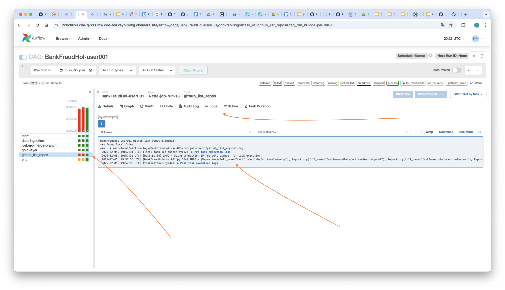

Une connexion Airflow a été créée à l'avance pour se connecter à ce compte via un token GitHub. Ouvrez la page des connexions pour explorer d'autres connexions.

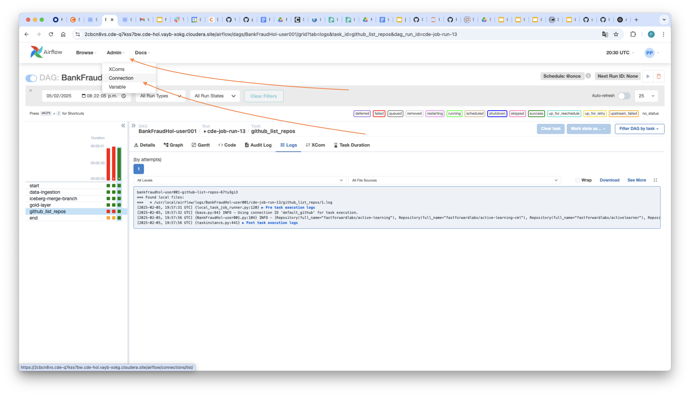

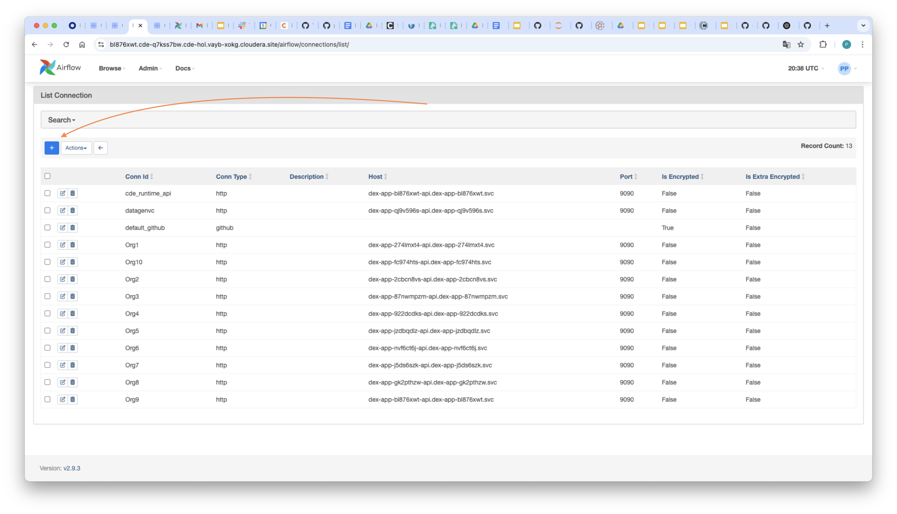

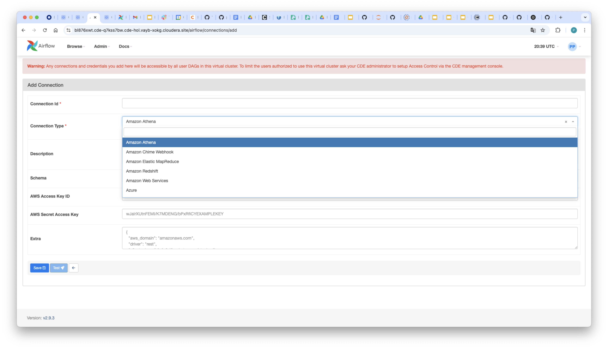

L'opérateur GitHub a été installé dans l'environnement Python Airflow du cluster virtuel. Retournez à la page des détails du cluster virtuel, ouvrez l'onglet Airflow et validez les packages installés.

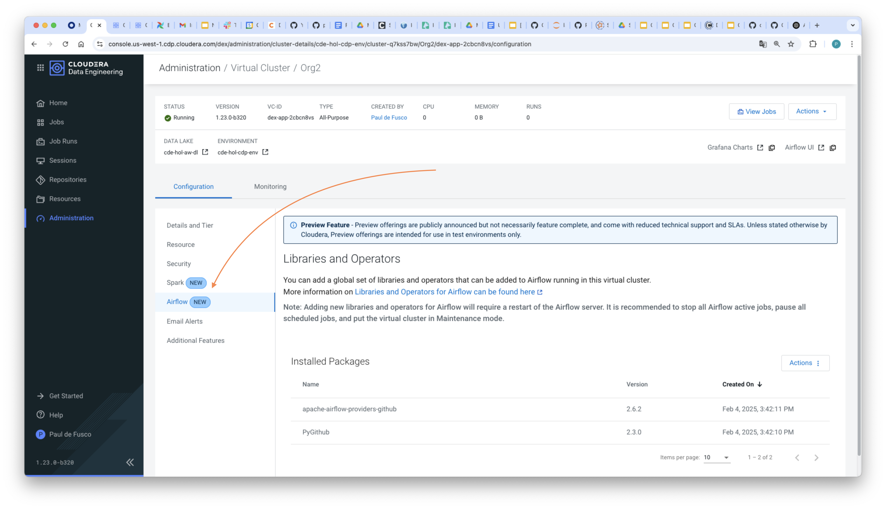

## Résumé et prochaines étapes

Apache Airflow est un outil open source d'automatisation et d'orchestration de workflows, conçu pour planifier, surveiller et gérer des pipelines de données complexes. Il permet aux utilisateurs de définir des workflows sous forme de graphes acycliques dirigés (DAGs) en Python, offrant flexibilité, évolutivité et automatisation dans le traitement des données. Grâce à ses intégrations intégrées, son interface Web conviviale et ses capacités robustes d'exécution des tâches, Airflow est largement utilisé en data engineering, dans les processus ETL et dans les pipelines de machine learning.

CDE intègre Apache Airflow au niveau du cluster virtuel CDE. Il est automatiquement déployé pour l'utilisateur CDE lors de la création du cluster virtuel CDE et ne nécessite aucune maintenance de la part de l'administrateur CDE.

Dans cette section des labs, nous avons déployé un pipeline Spark et Iceberg avec des dépôts git et CDE, et créé un pipeline d'orchestration de jobs avec Airflow. Vous pourriez également trouver les articles et démos suivants pertinents :

* [Documentation CDE Airflow](https://docs.cloudera.com/cdp-private-cloud-upgrade/latest/cdppvc-data-migration-spark/topics/cdp-migration-spark-cde-airflow-overview.html)
* [Utiliser Airflow dans CDE](https://docs.cloudera.com/cdp-private-cloud-upgrade/latest/cdppvc-data-migration-spark/topics/cdp-migration-spark-cde-using-airflow.html)
* [Créer un dépôt CDE dans CDE](https://docs.cloudera.com/data-engineering/1.5.4/manage-jobs/topics/cde-git-repo.html)
