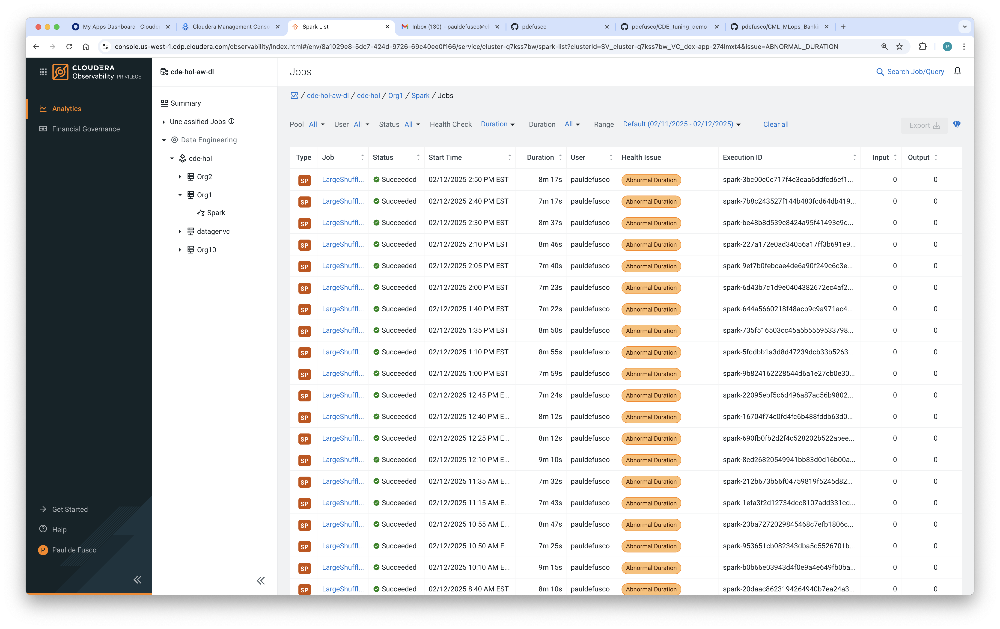
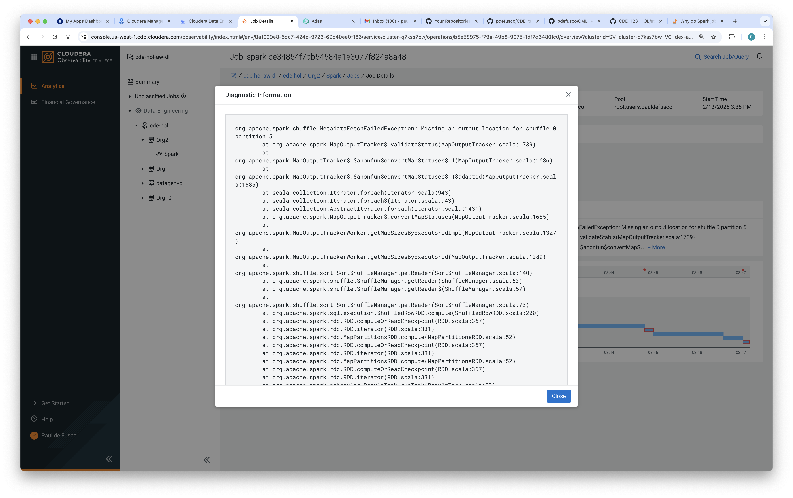

# Observabilité des Jobs et Gouvernance des Données dans CDP

## Contenu

5. [Surveiller les Jobs avec Cloudera Observability et CDE](https://github.com/pdefusco/CDE_121_HOL/blob/main/step_by_step_guides/english/part_03_observability.md#lab-5-monitoring-jobs-with-cloudera-observability-and-cde)
6. [Gouvernance des Jobs Spark avec le CDP Data Catalog](https://github.com/pdefusco/CDE_121_HOL/blob/main/step_by_step_guides/english/part_03_observability.md#lab-6-spark-job-governance-with-cdp-data-catalog)

## Lab 5. Surveiller les Jobs avec Cloudera Observability et CDE

CDE offre une fonctionnalité intégrée d'observabilité des Jobs incluant une interface utilisateur pour les exécutions de jobs, l'interface utilisateur d'Airflow, et la possibilité de télécharger les métadonnées et les logs des jobs via l'API et la CLI de CDE. De plus, les utilisateurs de CDE peuvent utiliser Cloudera Observability, un service Cloudera qui vous aide à comprendre de manière interactive votre environnement, les services de données, les charges de travail, les clusters et les ressources à travers tous les services de calcul dans un environnement CDP.

Lorsqu'une charge de travail est terminée, les informations diagnostiques concernant le job ou la requête et le cluster qui les a traitées sont collectées par le Télémetry Publisher et envoyées à Cloudera Observability, vous permettant ainsi d'optimiser vos requêtes et pipelines grâce à :

* Une large gamme de métriques et de tests de santé qui vous aident à identifier et résoudre les problèmes existants et potentiels.
* Des conseils et recommandations prescriptifs qui vous aident à résoudre rapidement ces problèmes et à optimiser vos solutions.
* Des repères de performance et une analyse historique qui vous aident à identifier et résoudre les problèmes de performance.

De plus, Cloudera Observability vous permet également de :

* Afficher visuellement les coûts actuels et historiques de votre cluster de charge de travail pour vous aider à planifier et prévoir les budgets, les futurs environnements de charges de travail, et justifier les groupes d'utilisateurs et les ressources actuels.
* Déclencher des actions en temps réel à travers les jobs et les requêtes pour vous aider à prendre des mesures pour atténuer les problèmes potentiels.
* Activer la livraison quotidienne des statistiques de votre cluster à votre adresse e-mail, ce qui vous permet de suivre, comparer et surveiller sans avoir à vous connecter au cluster.
* Décomposer vos métriques de charge de travail en vues plus significatives pour vos besoins professionnels afin de vous aider à analyser des critères de charge de travail spécifiques. Par exemple, vous pouvez analyser la performance des requêtes accédant à une base de données particulière ou utilisant une ressource spécifique par rapport à vos SLAs. Ou vous pouvez examiner comment toutes les requêtes envoyées par un utilisateur spécifique sont exécutées sur votre cluster.

#### Identifier la cause des Jobs Spark plus lents que d'habitude dans Cloudera Observability

Retournez dans l'interface principale de CDP et ouvrez Cloudera Observability. Sélectionnez et développez le Cluster Virtuel Org1, puis l'onglet "Spark". Recherchez l'application Spark "LargeShuffleExample" et identifiez les jobs qui prennent plus de temps que d'habitude. À quelle fréquence le job s'exécute-t-il plus lentement que d'habitude ?

Sélectionnez l'exécution du job ayant la durée la plus élevée et explorez l'onglet Détails d'exécution pour trouver des informations au niveau du job Spark et des étapes, ainsi que l'onglet Baseline pour trouver des métriques d'exécution granulaire de Spark. Dans l'onglet Baseline, cliquez sur l'icône "Afficher les métriques anormales" pour identifier les problèmes potentiels de votre exécution de job spécifique.

En inspectant les métriques de l'exécution actuelle et en les comparant avec la baseline, il semble qu'environ 20 % du temps, l'application effectue un Shuffle Spark anormal. Ensuite, ouvrez le code de l'application Spark et essayez d'identifier pourquoi cela se produit. Le code se trouve dans ["observability/skewApp.py"](https://github.com/pdefusco/CDE_123_HOL/blob/main/observability/skewApp.py)

#### Identifier la cause d'un échec d'un job Spark dans Cloudera Observability

Maintenant, passez au Cluster Virtuel Org2 dans Observability et ouvrez la vue des échecs de jobs. Identifiez une exécution échouée du job "ObsDemo" et explorez la trace d'erreur.

Il semble que votre job Spark ait échoué en raison de ressources insuffisantes. En particulier, une de vos partitions contient trop de données à cause d'un déséquilibre. Pour relancer le job avec succès, vous pourriez simplement augmenter la mémoire et les cœurs du Spark Executor, ou vous pourriez améliorer le code pour mieux gérer le déséquilibre des données.

## Lab 6. Gouvernance des Jobs Spark avec le CDP Data Catalog

Le CDP Data Catalog est un service au sein de CDP qui vous permet de comprendre, gérer, sécuriser et gouverner les actifs de données à travers l'entreprise. Le Data Catalog vous aide à comprendre les données à travers plusieurs clusters et environnements CDP. Avec le Data Catalog, vous pouvez comprendre comment les données sont interprétées pour leur utilisation, comment elles sont créées et modifiées, et comment l'accès aux données est sécurisé et protégé.

#### Explorer les Jobs dans Apache Atlas

Retournez à la page d'accueil de CDP, ouvrez le Data Catalog puis Atlas.

Atlas représente les métadonnées sous forme de types et d'entités et fournit des capacités de gestion des métadonnées et de gouvernance permettant aux organisations de construire, classer et gouverner les actifs de données.

Recherchez "spark_applications" dans la barre de recherche, puis sélectionnez une application Spark dans la liste et explorez ses métadonnées.

Dans le panneau Classifications, créez une nouvelle Classification de Métadonnées. Assurez-vous d'utiliser un nom unique.

Retournez à la page principale, trouvez une application Spark et ouvrez-la. Ensuite, appliquez la classification de métadonnées nouvellement créée.

Enfin, effectuez une nouvelle recherche, cette fois en utilisant la Classification que vous avez créée pour filtrer les Applications Spark.

## Résumé

Cloudera Observability est la solution d'observabilité unique de CDP, qui découvre et collecte continuellement des télémétries de performance à travers les données, les applications et les composants d'infrastructure exécutés dans les déploiements CDP sur des clouds privés et publics. Grâce à des analyses et des corrélations intelligentes et avancées, elle fournit des informations et des recommandations pour résoudre les problèmes complexes, optimiser les coûts et améliorer les performances.

CDP Data Catalog est un service de gestion des métadonnées qui aide les organisations à trouver, gérer et comprendre leurs données dans le cloud. Il s'agit d'un référentiel centralisé qui peut aider à la prise de décision basée sur les données, améliorer la gestion des données et augmenter l'efficacité opérationnelle.

Dans cette dernière section des labs, vous avez exploré les capacités de surveillance des exécutions de jobs dans CDE. En particulier, vous avez utilisé l'interface des exécutions de jobs de CDE pour conserver les métadonnées des exécutions de jobs, les logs Spark et l'interface Spark après l'exécution. Ensuite, vous avez utilisé Cloudera Observability pour explorer les métriques granulaires des exécutions de jobs et détecter les anomalies. Enfin, vous avez utilisé le CDP Data Catalog pour classer les exécutions de jobs Spark afin de gouverner et rechercher les métadonnées importantes des exécutions de jobs.

## Liens Utiles et Ressources

* [Documentation Cloudera Observability](https://docs.cloudera.com/observability/cloud/index.html)
* [CDP Data Catalog](https://docs.cloudera.com/data-catalog/cloud/index.html)
* [Documentation Apache Atlas](https://docs.cloudera.com/cdp-reference-architectures/latest/cdp-ra-security/topics/cdp-ra-security-apache-atlas.html)
* [Documentation Apache Ranger](https://docs.cloudera.com/cdp-reference-architectures/latest/cdp-ra-security/topics/cdp-ra-security-apache-ranger.html)
* [Surveiller Efficacement les Jobs, Exécutions et Ressources avec la CDE CLI](https://community.cloudera.com/t5/Community-Articles/Efficiently-Monitoring-Jobs-Runs-and-Resources-with-the-CDE/ta-p/379893)
