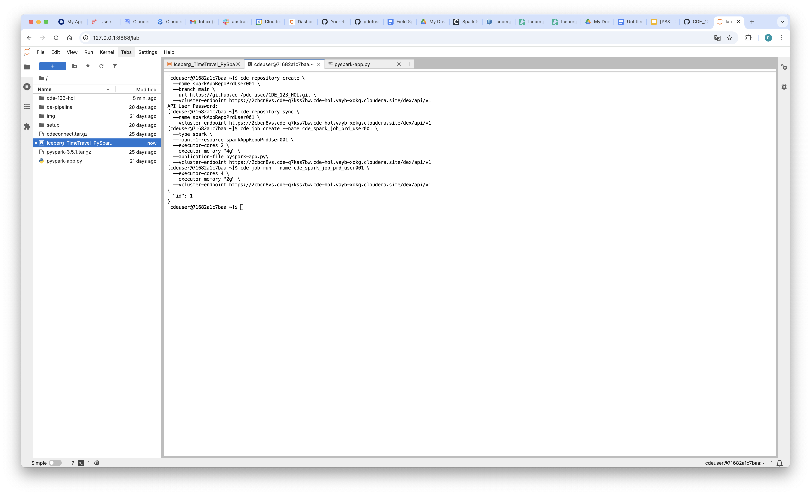
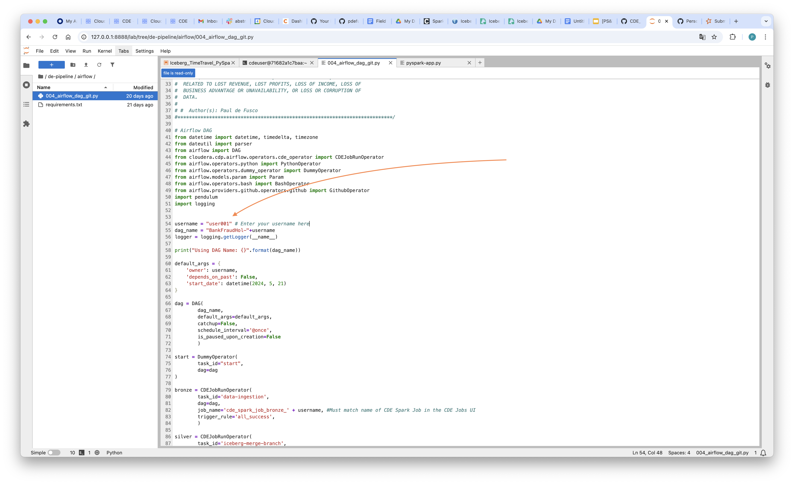
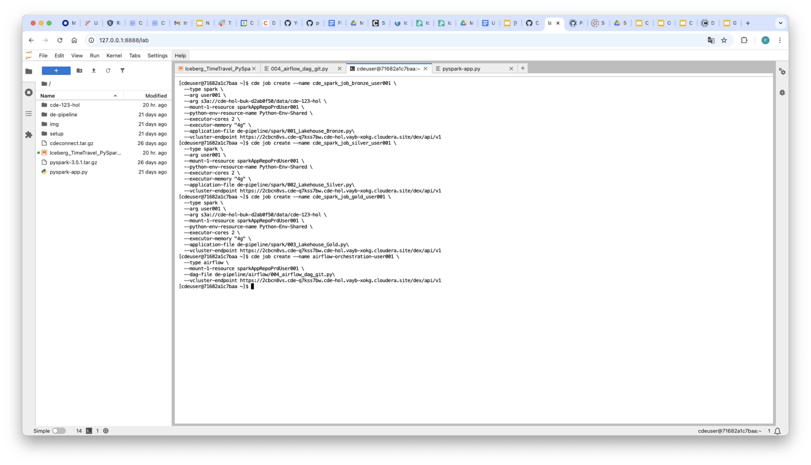
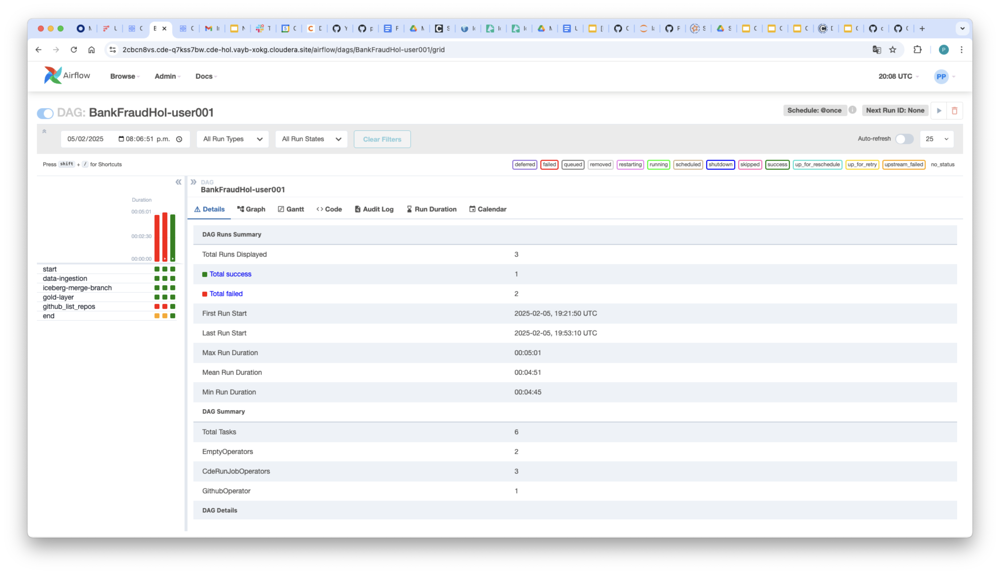
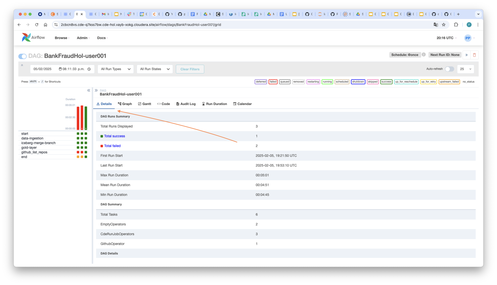
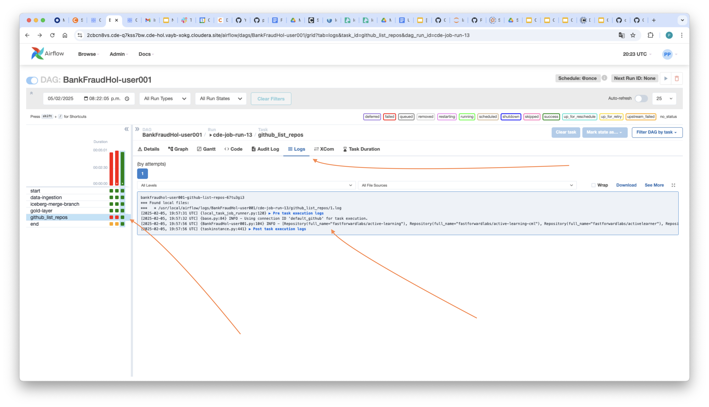
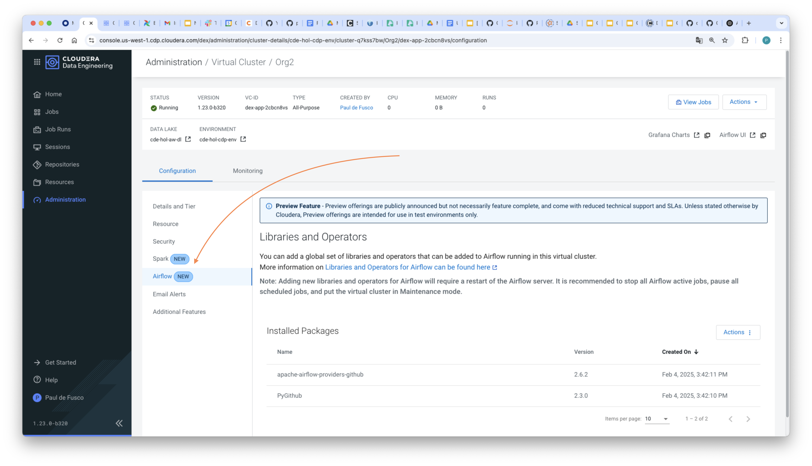

# Distribuzione e Orchestrazione con Airflow in CDE


## Contenuti

3. [Promuovere a un ambiente superiore usando l'API replicando il repository e ridistribuendo](https://github.com/pdefusco/CDE_124_HOL/blob/main/step_by_step_guides/english/03-deployment.md#lab-3-promote-to-higher-env-using-api-by-replicating-repo-and-redeploy)
4. [Creare un pipeline di orchestrazione con Airflow](https://github.com/pdefusco/CDE_124_HOL/blob/main/step_by_step_guides/english/03-deployment.md#lab-4-build-orchestration-pipeline-with-airflow)

## Laboratorio 3. Promuovere a un ambiente superiore usando l'API replicando il repository e ridistribuendo

Ora che il job è riuscito, distribuiscilo nel tuo cluster PRD.

Crea e sincronizza lo stesso repository Git dal Cluster PRD. D'ora in poi, esegui i seguenti comandi CLI utilizzando l'URL API Jobs del cluster PRD come parametro vcluster-endpoint.

```
cde repository create \
  --name sparkAppRepoPrdUser001 \
  --branch main \
  --url https://github.com/pdefusco/CDE_124_HOL.git \
  --vcluster-endpoint <your-PRD-vc-jobs-api-url-here>
```

```
cde repository sync \
  --name sparkAppRepoPrdUser001 \
  --vcluster-endpoint <your-PRD-vc-jobs-api-url-here>
```

Quindi crea un job Spark CDE utilizzando il repository CDE come dipendenza.

```
cde job create --name cde_spark_job_prd_user001 \
  --type spark \
  --mount-1-resource sparkAppRepoPrdUser001 \
  --executor-cores 2 \
  --executor-memory "4g" \
  --application-file pyspark-app.py\
  --vcluster-endpoint <your-PRD-vc-jobs-api-url-here> \
  --arg <your-storage-location-here>
```

```
cde job run --name cde_spark_job_prd_user001 \
  --executor-cores 4 \
  --executor-memory "2g" \
  --vcluster-endpoint <your-PRD-vc-jobs-api-url-here>
```



## Laboratorio 4. Creare un pipeline di orchestrazione con Airflow

Crea i job Spark CDE. Nota che sono classificati in Bronzo, Argento e Oro seguendo una Data Architecture Lakehouse.

```
cde job create --name cde_spark_job_bronze_user001 \
  --type spark \
  --arg <your-cdp-workload-username-here> \
  --arg <your-storage-location-here> \
  --mount-1-resource sparkAppRepoPrdUser001 \
  --python-env-resource-name Python-Env-Shared \
  --executor-cores 2 \
  --executor-memory "4g" \
  --application-file de-pipeline/spark/001_Lakehouse_Bronze.py\
  --vcluster-endpoint <your-PRD-vc-jobs-api-url-here>
```

```
cde job create --name cde_spark_job_silver_user001 \
  --type spark \
  --arg <your-cdp-workload-username-here> \
  --mount-1-resource sparkAppRepoPrdUser001 \
  --python-env-resource-name Python-Env-Shared \
  --executor-cores 2 \
  --executor-memory "4g" \
  --application-file de-pipeline/spark/002_Lakehouse_Silver.py\
  --vcluster-endpoint <your-PRD-vc-jobs-api-url-here>
```

```
cde job create --name cde_spark_job_gold_user001 \
  --type spark \
  --arg <your-cdp-workload-username-here> \
  --arg <your-storage-location-here> \
  --mount-1-resource sparkAppRepoPrdUser001 \
  --python-env-resource-name Python-Env-Shared \
  --executor-cores 2 \
  --executor-memory "4g" \
  --application-file de-pipeline/spark/003_Lakehouse_Gold.py\
  --vcluster-endpoint <your-PRD-vc-jobs-api-url-here>
```

Nel tuo editor, apri il DAG Airflow "004_airflow_dag_git" e modifica la variabile del tuo nome utente alla riga 54.



Poi crea il job CDE Airflow. Questo job orchestrerà i tuoi job Spark Lakehouse sopra indicati.

```
cde job create --name airflow-orchestration-user001 \
  --type airflow \
  --mount-1-resource sparkAppRepoPrdUser001 \
  --dag-file de-pipeline/airflow/004_airflow_dag_git.py\
  --vcluster-endpoint <your-PRD-vc-jobs-api-url-here>
```




Non è necessario avviare manualmente l'esecuzione del job Airflow. I parametri del DAG includono già una pianificazione. Al momento della creazione, il Job CDE Airflow verrà eseguito a breve. Puoi seguire i progressi nell'interfaccia Job Runs UI.


Puoi utilizzare l'interfaccia Airflow per ispezionare i tuoi pipeline. Dalla pagina dei dettagli del Virtual Cluster, apri l'interfaccia Airflow e individua il tuo DAG Airflow.




Airflow offre una varietà di diagrammi, grafici e visualizzazioni per monitorare le tue esecuzioni su task, dag e operatori. Esegui il tuo DAG Airflow più volte dall'interfaccia Jobs UI di CDE e torna all'interfaccia Airflow per ispezionare i tuoi task su diverse esecuzioni e altro.





CDE Airflow supporta provider di terze parti, ovvero pacchetti esterni che estendono la funzionalità di Apache Airflow aggiungendo integrazioni con altri sistemi, servizi e strumenti come AWS, Google Cloud, Microsoft Azure, database, broker di messaggi e molti altri servizi. I provider sono open source e possono essere installati separatamente in base alle specifiche esigenze di un progetto.

Seleziona il Task GitHub List Repos, apri i log e nota che viene fornito l'output. In questo particolare task hai utilizzato l'operatore GitHub per elencare i repository da un account GitHub.



È stata creata in anticipo una connessione Airflow per connettersi a questo account tramite il token GitHub. Apri la pagina Connections per esplorare altre connessioni.


L'operatore GitHub è stato installato nell'ambiente Python di Airflow del Virtual Cluster. Torna alla pagina dei dettagli del Virtual Cluster, apri la scheda Airflow e verifica i pacchetti installati.



## Riepilogo e prossimi passi

Apache Airflow è uno strumento open-source per l'automazione e l'orchestrazione dei flussi di lavoro progettato per la pianificazione, il monitoraggio e la gestione di pipeline di dati complesse. Consente agli utenti di definire flussi di lavoro come Grafi Acentrici Diretti (DAG) usando Python, consentendo flessibilità, scalabilità e automazione nel trattamento dei dati. Con le integrazioni integrate, un'interfaccia web facile da usare e robuste capacità di esecuzione dei task, Airflow è ampiamente utilizzato in ingegneria dei dati, processi ETL e pipeline di machine learning.

CDE incorpora Apache Airflow a livello di CDE Virtual Cluster. Viene automaticamente distribuito per l'utente CDE durante la creazione del Virtual Cluster CDE e non richiede manutenzione da parte dell'amministratore CDE.

In questa sezione dei laboratori abbiamo distribuito un pipeline Spark e Iceberg con repository git e CDE, e creato una pipeline di orchestrazione dei job con Airflow. Potresti trovare anche utili i seguenti articoli e demo:

* [Documentazione di CDE Airflow](https://docs.cloudera.com/cdp-private-cloud-upgrade/latest/cdppvc-data-migration-spark/topics/cdp-migration-spark-cde-airflow-overview.html)
* [Uso di Airflow in CDE](https://docs.cloudera.com/cdp-private-cloud-upgrade/latest/cdppvc-data-migration-spark/topics/cdp-migration-spark-cde-using-airflow.html)
* [Creare un Repository CDE in CDE](https://docs.cloudera.com/data-engineering/1.5.4/manage-jobs/topics/cde-git-repo.html)
