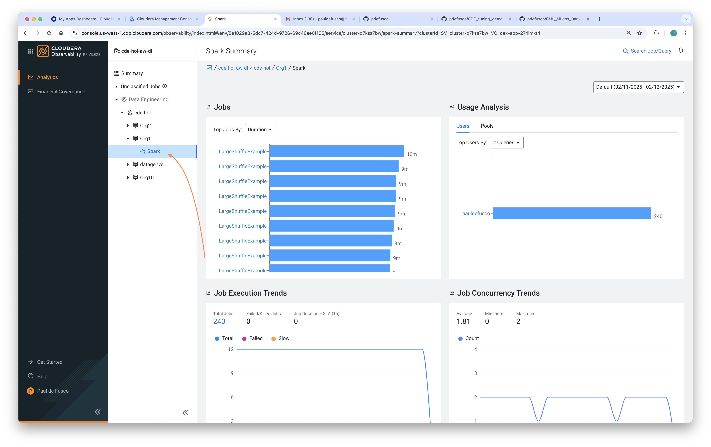
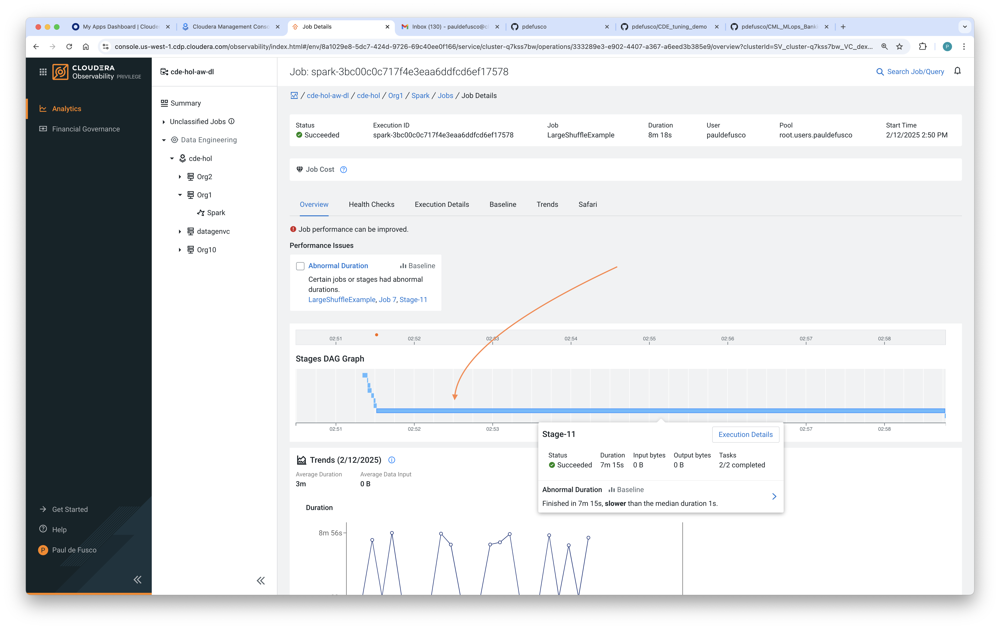
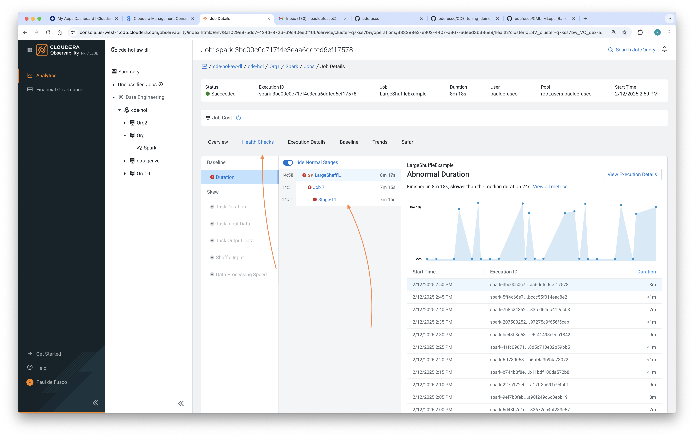
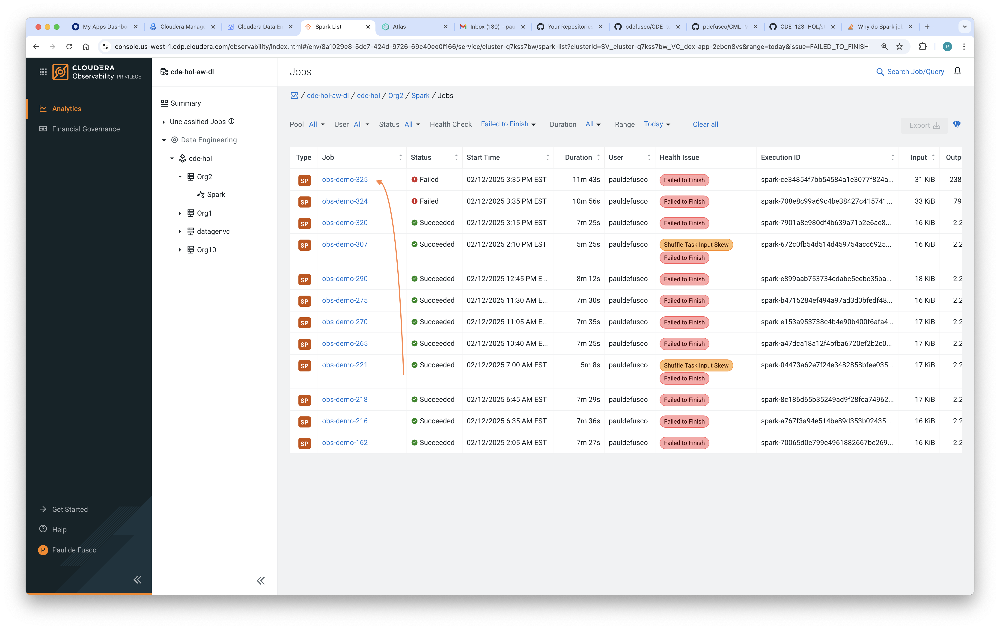

# Osservabilità dei Job & Governance dei Dati in CDP

## Contenuti

5. [Monitorare i Job con Cloudera Observability e CDE](https://github.com/pdefusco/CDE_121_HOL/blob/main/step_by_step_guides/english/part_03_observability.md#lab-5-monitoring-jobs-with-cloudera-observability-and-cde)
6. [Governance dei Job Spark con CDP Data Catalog](https://github.com/pdefusco/CDE_121_HOL/blob/main/step_by_step_guides/english/part_03_observability.md#lab-6-spark-job-governance-with-cdp-data-catalog)

## Lab 5. Monitoraggio dei Job con Cloudera Observability e CDE

CDE fornisce una funzionalità integrata di osservabilità dei Job, inclusi una UI dei Job Runs, la UI di Airflow e la possibilità di scaricare i metadati dei job e i log tramite l'API e la CLI di CDE. Inoltre, gli utenti CDE possono sfruttare Cloudera Observability, un servizio Cloudera che ti aiuta a comprendere interattivamente il tuo ambiente, i servizi di dati, i carichi di lavoro, i cluster e le risorse in tutti i servizi di calcolo in un ambiente CDP.

Quando un carico di lavoro viene completato, le informazioni diagnostiche sul job o sulla query e sul cluster che li ha elaborati vengono raccolte dal Telemetry Publisher e inviate a Cloudera Observability, in modo da ottimizzare le tue query e pipeline tramite:

* Un'ampia gamma di metriche e test di salute che ti aiutano a identificare e risolvere sia i problemi esistenti che quelli potenziali.
* Indicazioni prescrittive e raccomandazioni che ti aiutano ad affrontare rapidamente i problemi e ottimizzare le soluzioni.
* Linee guida sulle prestazioni e analisi storiche che ti aiutano a identificare e risolvere problemi di prestazioni.

Inoltre, Cloudera Observability consente anche di:

* Visualizzare i costi attuali e storici del cluster del carico di lavoro, che ti aiutano a pianificare e prevedere i budget, i futuri ambienti di lavoro e giustificare i gruppi di utenti e le risorse attuali.
* Attivare azioni in tempo reale su job e query che ti aiutano a prendere provvedimenti per alleviare potenziali problemi.
* Abilitare la consegna giornaliera delle statistiche del cluster al tuo indirizzo e-mail, che ti aiutano a tracciare, confrontare e monitorare senza dover accedere al cluster.
* Suddividere le metriche del carico di lavoro in visualizzazioni più significative per le tue esigenze aziendali che ti aiutano ad analizzare criteri specifici del carico di lavoro. Ad esempio, puoi analizzare come le query che accedono a un particolare database o che utilizzano una specifica risorsa di pool si comportano rispetto ai tuoi SLA. Oppure puoi esaminare come si comportano tutte le query inviate da un determinato utente nel tuo cluster.

#### Identificare la causa dei job Spark più lenti del solito in CDP Observability

Esci da CDE e torna alla pagina principale di CDP, quindi apri CDP Observability. Seleziona ed espandi il Virtual Cluster Org1 e poi la scheda "Spark". Cerca l'applicazione Spark "LargeShuffleExample" e identifica i job che impiegano più tempo del solito. Quanto spesso il job sta impiegando più tempo del previsto?

Seleziona l'esecuzione del job con la durata più lunga ed esplora la scheda Dettagli di esecuzione per trovare informazioni sui job Spark e sul livello di Stage, e la scheda Baseline per trovare metriche granulari di esecuzione di Spark. Nella scheda Baseline, clicca sull'icona "Mostra metriche anomale" per identificare potenziali problemi con l'esecuzione di quel particolare job.

Esaminando le metriche dell'esecuzione corrente e confrontandole con la baseline, sembra che circa il 20% del tempo l'applicazione stia eseguendo uno Spark Shuffle anomalo. Successivamente, apri il codice dell'applicazione Spark e prova a capire perché stia accadendo. Il codice si trova in ["observability/skewApp.py"](https://github.com/pdefusco/CDE_123_HOL/blob/main/observability/skewApp.py)

#### Identificare la causa di un job Spark fallito in CDP Observability

Ora passa al Virtual Cluster Org2 in Observability e apri la vista degli errori dei job. Identifica una corsa fallita del job "ObsDemo" ed esplora la traccia dell'errore.

Sembra che il tuo job Spark sia fallito a causa di risorse insufficienti. In particolare, una delle tue partizioni contiene troppi dati a causa dello skew. Per rieseguire correttamente il job, potresti aumentare semplicemente la memoria e i core dell'Executor di Spark, oppure potresti migliorare il codice per gestire meglio lo skew dei dati.

## Lab 6. Governance dei Job Spark con CDP Data Catalog

Il CDP Data Catalog è un servizio all'interno di CDP che ti consente di comprendere, gestire, proteggere e governare le risorse dati in tutta l'azienda. Il Data Catalog ti aiuta a comprendere i dati tra più cluster e tra vari ambienti CDP. Utilizzando il Data Catalog, puoi capire come i dati vengono interpretati per l'uso, come vengono creati e modificati e come l'accesso ai dati è protetto e sicuro.

#### Esplora i Job in Apache Atlas

Torna alla pagina principale di CDP, apri Data Catalog e quindi Atlas.

Atlas rappresenta i metadati come tipi e entità e fornisce capacità di gestione dei metadati e governance per le organizzazioni al fine di costruire, categorizzare e governare le risorse dati.

Cerca "spark_applications" nella barra di ricerca, quindi seleziona un'applicazione Spark dalla lista ed esplora i suoi metadati.

Nel pannello delle Classificazioni, crea una nuova Classificazione dei Metadati. Assicurati di usare un nome unico.

Torna alla pagina principale, trova un'applicazione Spark e aprila. Poi applica la nuova Classificazione dei Metadati creata.

Infine, esegui una nuova ricerca, questa volta utilizzando la Classificazione che hai creato per filtrare le Applicazioni Spark.

## Riepilogo

Cloudera Observability è la soluzione di osservabilità “single pane of glass” di CDP, che scopre continuamente e raccoglie la telemetria delle prestazioni su dati, applicazioni e componenti infrastrutturali che operano nei deployment CDP su cloud privati e pubblici. Con analisi avanzate e intelligenti e correlazioni, fornisce approfondimenti e raccomandazioni per affrontare problematiche complesse, ottimizzare i costi e migliorare le prestazioni.

CDP Data Catalog è un catalogo di dati cloud, un servizio di gestione dei metadati che aiuta le organizzazioni a trovare, gestire e comprendere i propri dati nel cloud. È un repository centralizzato che può aiutare nelle decisioni basate sui dati, migliorare la gestione dei dati e aumentare l'efficienza operativa.

In questa sezione finale dei laboratori hai esplorato le capacità di monitoraggio dei Job Run in CDE. In particolare, hai utilizzato la UI dei Job Runs di CDE per memorizzare i metadati dei Job Run, i log di Spark e la UI di Spark post-esecuzione. Poi, hai usato CDP Observability per esplorare metriche granulari dei Job Run e rilevare anomalie. Infine, hai utilizzato CDP Data Catalog per classificare i Job Spark e governare e ricercare i metadati dei Job Run importanti.

## Link Utili e Risorse

* [Documentazione di Cloudera Observability](https://docs.cloudera.com/observability/cloud/index.html)
* [CDP Data Catalog](https://docs.cloudera.com/data-catalog/cloud/index.html)
* [Documentazione di Apache Atlas](https://docs.cloudera.com/cdp-reference-architectures/latest/cdp-ra-security/topics/cdp-ra-security-apache-atlas.html)
* [Documentazione di Apache Ranger](https://docs.cloudera.com/cdp-reference-architectures/latest/cdp-ra-security/topics/cdp-ra-security-apache-ranger.html)
* [Monitoraggio Efficiente di Job, Run e Risorse con la CDE CLI](https://community.cloudera.com/t5/Community-Articles/Efficiently-Monitoring-Jobs-Runs-and-Resources-with-the-CDE/ta-p/379893)
