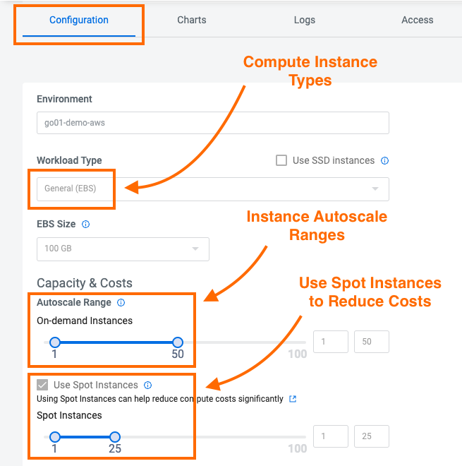
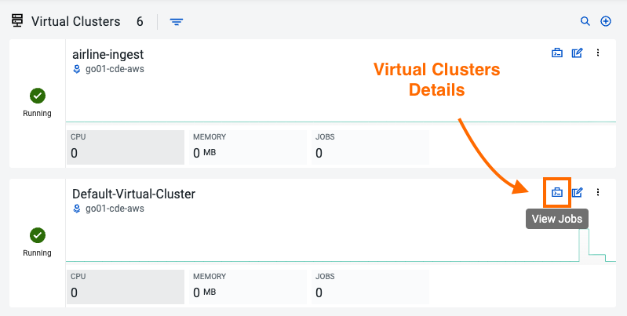

# Arquitetura CDE

## Objetivo

Nesta seção, você aprenderá sobre a arquitetura flexível do CDE e seus principais componentes.

## Índice

* [Introdução ao Serviço CDE](https://github.com/pdefusco/CDE119_ACE_WORKSHOP/blob/main/step_by_step_guides/english/part01_cde_architecture.md#introducao-ao-serviço-cde)
  * [Ambiente CDP](https://github.com/pdefusco/CDE119_ACE_WORKSHOP/blob/main/step_by_step_guides/english/part01_cde_architecture.md#ambiente-cdp)
  * [Serviço CDE](https://github.com/pdefusco/CDE119_ACE_WORKSHOP/blob/main/step_by_step_guides/english/part01_cde_architecture.md#serviço-cde)
  * [Cluster Virtual](https://github.com/pdefusco/CDE119_ACE_WORKSHOP/blob/main/step_by_step_guides/english/part01_cde_architecture.md#cluster-virtual)
  * [Jobs CDE](https://github.com/pdefusco/CDE119_ACE_WORKSHOP/blob/main/step_by_step_guides/english/part01_cde_architecture.md#jobs)
  * [Recurso CDE](https://github.com/pdefusco/CDE119_ACE_WORKSHOP/blob/main/step_by_step_guides/english/part01_cde_architecture.md#recurso)
  * [Execução de Job](https://github.com/pdefusco/CDE119_ACE_WORKSHOP/blob/main/step_by_step_guides/english/part01_cde_architecture.md#execucao-de-job)
  * [Sessões CDE](https://github.com/pdefusco/CDE119_ACE_WORKSHOP/blob/main/step_by_step_guides/english/part01_cde_architecture.md#sessao-cde)
  * [Apache Iceberg](https://github.com/pdefusco/CDE119_ACE_WORKSHOP/blob/main/step_by_step_guides/english/part01_cde_architecture.md#apache-iceberg)
  * [Interface de Usuário CDE](https://github.com/pdefusco/CDE119_ACE_WORKSHOP/blob/main/step_by_step_guides/english/part01_cde_architecture.md#interface-de-usuario-cde)
* [Resumo](https://github.com/pdefusco/CDE119_ACE_WORKSHOP/blob/main/step_by_step_guides/english/part01_cde_architecture.md#resumo)

## Introdução ao Serviço CDE

Cloudera Data Engineering (CDE) é um serviço para a Cloudera Data Platform que permite enviar jobs em lote para clusters virtuais autoescaláveis. O CDE permite que você passe mais tempo em suas aplicações e menos tempo com a infraestrutura.

O Cloudera Data Engineering permite que você crie, gerencie e agende jobs do Apache Spark sem a sobrecarga de criar e manter clusters Spark. Com o Cloudera Data Engineering, você define clusters virtuais com uma gama de recursos de CPU e memória, e o cluster escala para cima e para baixo conforme necessário para executar suas cargas de trabalho Spark, ajudando a controlar os custos na nuvem.

O Serviço CDE pode ser acessado a partir da Página Inicial do CDP clicando no ícone azul "Data Engineering".

A página de entrada do CDE permite acessar, criar e gerenciar os Serviços CDE e Clusters Virtuais. Dentro de cada Serviço CDE, você pode implantar um ou mais Clusters Virtuais CDE. No Cluster Virtual, você pode criar, monitorar e solucionar problemas de Jobs Spark e Airflow.

O Serviço CDE está vinculado ao Ambiente CDP. Cada Serviço CDE é mapeado para no máximo um Ambiente CDP, enquanto um Ambiente CDP pode ser mapeado para um ou mais Serviços CDE.

Estes são os componentes mais importantes no Serviço CDE:

##### Ambiente CDP
Um subconjunto lógico da sua conta de provedor de nuvem, incluindo uma rede virtual específica. Os Ambientes CDP podem estar no AWS, Azure, RedHat OCP e Cloudera ECS. Para mais informações, veja [Ambientes CDP](https://docs.cloudera.com/management-console/cloud/overview/topics/mc-core-concepts.html). Praticamente falando, um ambiente é equivalente a um Data Lake, pois cada ambiente é automaticamente associado aos seus próprios serviços SDX para Segurança, Governança e Linhagem.

##### Serviço CDE
O cluster Kubernetes de longa duração e os serviços que gerenciam os clusters virtuais. O serviço CDE deve ser habilitado em um ambiente antes que você possa criar qualquer cluster virtual.

##### Cluster Virtual
Um cluster de autoescalabilidade individual com faixas predefinidas de CPU e memória. Os Clusters Virtuais no CDE podem ser criados e excluídos sob demanda. Os trabalhos estão associados aos clusters. Ao implantar um Cluster Virtual, você pode escolher entre dois níveis de cluster:

*Core (Nível 1)*: Opções de transformação e engenharia baseadas em lote incluem:
* Cluster Autoescalável
* Instâncias Spot
* SDX/Lakehouse
* Ciclo de Vida do Job
* Monitoramento
* Orquestração de Workflow

*All Purpose (Nível 2)*: Desenvolva usando sessões interativas e implante cargas de trabalho tanto em lote quanto de streaming. Esta opção inclui todas as opções no Nível 1, com a adição das seguintes:
* Sessões Shell - CLI e Web
* JDBC/SparkSQL (Chegando em Outubro de 2023 com o CDE 1.20)
* IDE (Chegando em Outubro de 2023 com o CDE 1.20)

Os clusters Core são recomendados como ambientes de Produção. Já os clusters All Purpose são projetados para serem usados como ambientes de Desenvolvimento e Testes.  
Para mais informações sobre os lançamentos do CDE 1.19.1 e 1.19.2, visite esta página na [documentação](https://docs.cloudera.com/data-engineering/cloud/release-notes/topics/cde-whats-new-1.19.html).

##### Jobs
Código de aplicação juntamente com configurações e recursos definidos. Jobs podem ser executados sob demanda ou agendados. A execução de um job individual é chamada de execução de job.

##### Recurso
Uma coleção definida de arquivos, como um arquivo Python ou um aplicativo JAR, dependências e quaisquer outros arquivos de referência necessários para um job.

##### Execução de Job
Uma execução individual de um job.

##### Sessão CDE

As sessões interativas CDE fornecem aos engenheiros de dados pontos finais flexíveis para começar a desenvolver aplicações Spark de qualquer lugar – em um terminal baseado na web, CLI local, IDE favorita e até via JDBC de ferramentas de terceiros.

##### Apache Iceberg

Apache Iceberg é um formato de tabela nativo da nuvem e de alto desempenho para organizar conjuntos de dados analíticos em escala petabyte em um sistema de arquivos ou armazenamento de objetos. Combinado com o Cloudera Data Platform (CDP), os usuários podem construir uma arquitetura de lakehouse de dados abertos para análises multifuncionais e implantar pipelines em grande escala de ponta a ponta.

O Lakehouse de Dados Abertos no CDP simplifica análises avançadas sobre todos os dados com uma plataforma unificada para dados estruturados e não estruturados e serviços de dados integrados para permitir qualquer caso de uso analítico, de ML, BI a análises de streaming e análises em tempo real. Apache Iceberg é o "ingrediente secreto" do lakehouse aberto.

Iceberg é compatível com uma variedade de mecanismos de computação, incluindo o Spark. O CDE permite que você implante Clusters Virtuais habilitados para Iceberg.

Para mais informações, visite a [documentação](https://iceberg.apache.org/).

##### Interface de Usuário CDE

Agora que você cobriu os conceitos básicos do CDE, passe alguns minutos se familiarizando com a Página de Aterrissagem do CDE.

A Página Inicial fornece uma visão geral de alto nível de todos os Serviços e Clusters CDE. Na parte superior, você tem atalhos para criar Jobs e Recursos CDE.

Desça até a seção de Clusters Virtuais CDE e note que todos os Clusters Virtuais e cada Ambiente CDP / Serviço CDE associado estão mostrados.

Em seguida, abra a página de Administração na aba à esquerda. Esta página também mostra os Serviços CDE à esquerda e os Clusters Virtuais associados à direita.

Abra a página de Detalhes do Serviço CDE e note as seguintes informações e links importantes:

* Versão do CDE
* Faixa de Autoscale de Nós
* Data Lake CDP e Ambiente
* Gráficos do Graphana. Clique neste link para obter um painel dos recursos do Kubernetes do serviço em execução.
* Agendador de Recursos. Clique neste link para visualizar a interface web do Yunikorn.

Desça e abra a aba Configurações. Note que é aqui onde os Tipos de Instância e Faixas de Autoscale de Instância são definidos.

Para saber mais sobre outras configurações importantes do serviço, visite [Habilitando um Serviço CDE](https://docs.cloudera.com/data-engineering/cloud/enable-data-engineering/topics/cde-enable-data-engineering.html) na documentação do CDE.

Navegue de volta até a página de Administração e abra a página de Detalhes do Cluster de um Cluster Virtual.

Esta visualização inclui outras informações importantes sobre o gerenciamento do cluster. A partir daqui você pode:

* Baixar os binários do CLI CDE. O CLI é recomendado para enviar jobs e interagir com o CDE. Ele é coberto na Parte 3 deste guia.
* Visitar a documentação da API para aprender a API CDE e criar requisições de exemplo na página Swagger.
* Acessar a interface do Airflow para monitorar seus Jobs do Airflow, configurar conexões personalizadas, variáveis e mais.

Abra a aba Configuração. Note que você pode selecionar entre Clusters dos Níveis Core e All Purpose.  
Além disso, esta visualização fornece opções para definir faixas de autoscale de CPU e memória, versão do Spark, e opções Iceberg são configuradas aqui. O CDE oferece suporte às versões do Spark 3.5.1.

Para saber mais sobre a Arquitetura do CDE, visite [Criando e Gerenciando Clusters Virtuais](https://docs.cloudera.com/data-engineering/cloud/manage-clusters/topics/cde-create-cluster.html) e [Recomendações para Escalabilidade de Implantações CDE](https://docs.cloudera.com/data-engineering/cloud/deployment-architecture/topics/cde-general-scaling.html).

## Resumo

Um Serviço CDE define os tipos de instâncias de computação, faixas de autoscale de instâncias e o Data Lake CDP associado. Os Dados e Usuários associados ao Serviço são submetidos pelos SDX e pelas configurações do Ambiente CDP. Você pode utilizar o SDX Atlas e Ranger para visualizar metadados de tabelas e jobs e proteger o acesso de usuários e dados com políticas de acesso detalhadas.

Dentro de um Serviço CDE, você pode implantar um ou mais Clusters Virtuais CDE. A Faixa de Autoscale do Serviço é uma contagem de instâncias mínimas/máximas de Computação permitidas. A Faixa de Autoscale do Cluster Virtual é a CPU e Memória mínimas/máximas que podem ser alocadas por tipo de instância.

CDE oferece suporte às versões do Spark 3.5.1. Os Clusters Virtuais do CDE são implantados com uma versão do Spark por Cluster Virtual.

Essa arquitetura flexível permite isolar suas cargas de trabalho e limitar o acesso dentro de diferentes clusters de computação com escalonamento automático, enquanto define antecipadamente limites de gerenciamento de custos em um nível agregado. Por exemplo, você pode definir Serviços em um nível organizacional e Clusters Virtuais dentro deles como DEV, QA, PROD, etc.

O CDE aproveita as políticas de agendamento e ordenação de recursos do YuniKorn, como agendamento em grupo (gang scheduling) e empacotamento em contêineres (bin packing), para otimizar a utilização de recursos e melhorar a eficiência de custos. Para mais informações sobre agendamento em grupo, consulte o post do blog da Cloudera [Spark no Kubernetes – Agendamento em Grupo com YuniKorn](https://blog.cloudera.com/spark-on-kubernetes-gang-scheduling-with-yunikorn/).

O escalonamento automático de Jobs do Spark no CDE é controlado pela alocação dinâmica do Apache Spark. A alocação dinâmica ajusta o número de executores de jobs para cima ou para baixo conforme necessário para os jobs em execução. Isso pode proporcionar grandes benefícios de desempenho, alocando tantos recursos quanto forem necessários pelo job em execução e devolvendo recursos quando não forem mais necessários, para que jobs concorrentes possam potencialmente ser executados mais rapidamente.
