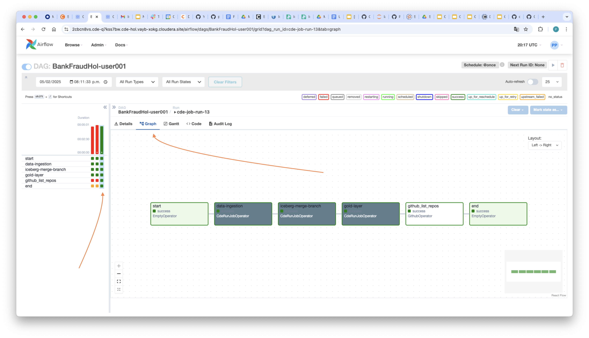
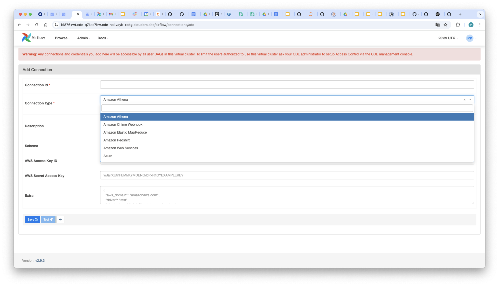

# Implantação & Orquestração com Airflow no CDE


## Conteúdo

3. [Promover para um ambiente superior usando API replicando o repositório e redeploy](https://github.com/pdefusco/CDE_124_HOL/blob/main/step_by_step_guides/english/03-deployment.md#lab-3-promote-to-higher-env-using-api-by-replicating-repo-and-redeploy)
4. [Construir pipeline de orquestração com Airflow](https://github.com/pdefusco/CDE_124_HOL/blob/main/step_by_step_guides/english/03-deployment.md#lab-4-build-orchestration-pipeline-with-airflow)

## Lab 3. Promover para um ambiente superior usando API replicando o repositório e redeploy

Agora que o trabalho foi concluído com sucesso, implante-o no seu cluster PRD.

Crie e sincronize o mesmo repositório Git no Cluster PRD. A partir de agora, execute os seguintes comandos CLI com a URL da API de Jobs do seu cluster PRD como parâmetro `vcluster-endpoint`.

```
cde repository create \
  --name sparkAppRepoPrdUser001 \
  --branch main \
  --url https://github.com/pdefusco/CDE_124_HOL.git \
  --vcluster-endpoint <sua-url-api-jobs-do-cluster-prd-aqui>
```

```
cde repository sync \
  --name sparkAppRepoPrdUser001 \
  --vcluster-endpoint <sua-url-api-jobs-do-cluster-prd-aqui>
```

Em seguida, crie um Job Spark no CDE aproveitando o repositório CDE como dependência.

```
cde job create --name cde_spark_job_prd_user001 \
  --type spark \
  --mount-1-resource sparkAppRepoPrdUser001 \
  --executor-cores 2 \
  --executor-memory "4g" \
  --application-file pyspark-app.py\
  --vcluster-endpoint <sua-url-api-jobs-do-cluster-prd-aqui> \
  --arg <sua-localização-de-armazenamento-aqui>
```

```
cde job run --name cde_spark_job_prd_user001 \
  --executor-cores 4 \
  --executor-memory "2g" \
  --vcluster-endpoint <sua-url-api-jobs-do-cluster-prd-aqui>
```


## Lab 4. Construir pipeline de orquestração com Airflow

Crie os Jobs Spark do CDE. Note que esses estão categorizados em Bronze, Silver e Gold seguindo uma arquitetura de Lakehouse.

```
cde job create --name cde_spark_job_bronze_user001 \
  --type spark \
  --arg <seu-username-do-cdp-aqui> \
  --arg <sua-localização-de-armazenamento-aqui> \
  --mount-1-resource sparkAppRepoPrdUser001 \
  --python-env-resource-name Python-Env-Shared \
  --executor-cores 2 \
  --executor-memory "4g" \
  --application-file de-pipeline/spark/001_Lakehouse_Bronze.py\
  --vcluster-endpoint <sua-url-api-jobs-do-cluster-prd-aqui>
```

```
cde job create --name cde_spark_job_silver_user001 \
  --type spark \
  --arg <seu-username-do-cdp-aqui> \
  --mount-1-resource sparkAppRepoPrdUser001 \
  --python-env-resource-name Python-Env-Shared \
  --executor-cores 2 \
  --executor-memory "4g" \
  --application-file de-pipeline/spark/002_Lakehouse_Silver.py\
  --vcluster-endpoint <sua-url-api-jobs-do-cluster-prd-aqui>
```

```
cde job create --name cde_spark_job_gold_user001 \
  --type spark \
  --arg <seu-username-do-cdp-aqui> \
  --arg <sua-localização-de-armazenamento-aqui> \
  --mount-1-resource sparkAppRepoPrdUser001 \
  --python-env-resource-name Python-Env-Shared \
  --executor-cores 2 \
  --executor-memory "4g" \
  --application-file de-pipeline/spark/003_Lakehouse_Gold.py\
  --vcluster-endpoint <sua-url-api-jobs-do-cluster-prd-aqui>
```

No seu editor, abra o DAG do Airflow "004_airflow_dag_git" e edite a variável `username` na linha 54.


Em seguida, crie o Job Airflow do CDE. Este job irá orquestrar seus Jobs Lakehouse Spark acima.

```
cde job create --name airflow-orchestration-user001 \
  --type airflow \
  --mount-1-resource sparkAppRepoPrdUser001 \
  --dag-file de-pipeline/airflow/004_airflow_dag_git.py\
  --vcluster-endpoint <sua-url-api-jobs-do-cluster-prd-aqui>
```


Não há necessidade de disparar manualmente o job do Airflow. Os parâmetros do DAG já incluem um cronograma. Após a criação, o Job do CDE Airflow será executado em breve. Você pode acompanhar o progresso na interface de Jobs.


Você pode usar a interface do Airflow para inspecionar seus pipelines. Na página de detalhes do Virtual Cluster, abra a interface do Airflow e localize seu DAG do Airflow.


O Airflow fornece uma variedade de diagramas, gráficos e visuais para monitorar suas execuções por tarefas, dags e operadores. Execute seu DAG do Airflow várias vezes a partir da interface de Jobs do CDE e volte à interface do Airflow para inspecionar suas tarefas em diferentes execuções, entre outros.





O CDE Airflow suporta provedores de terceiros, ou seja, pacotes externos que estendem a funcionalidade do Apache Airflow adicionando integrações com outros sistemas, serviços e ferramentas, como AWS, Google Cloud, Microsoft Azure, bancos de dados, corretores de mensagens e muitos outros serviços. Os provedores são de código aberto e podem ser instalados separadamente com base nas necessidades específicas de um projeto.

Selecione a Tarefa "GitHub List Repos", abra os logs e note que a saída é fornecida. Nesta tarefa específica, você usou o GitHub Operator para listar repositórios de uma conta do GitHub.


Uma Conexão do Airflow foi criada antecipadamente para conectar-se a esta conta via token do GitHub. Abra a página de Conexões para explorar mais conexões.




O GitHub Operator foi instalado no ambiente Python do Airflow do Virtual Cluster. Navegue de volta para a página de detalhes do Virtual Cluster, abra a guia do Airflow e valide os pacotes instalados.


## Resumo e Próximos Passos

O Apache Airflow é uma ferramenta de automação e orquestração de workflows de código aberto projetada para agendamento, monitoramento e gerenciamento de pipelines de dados complexos. Ele permite que os usuários definam workflows como Grafos Acíclicos Dirigidos (DAGs) usando Python, proporcionando flexibilidade, escalabilidade e automação no processamento de dados. Com integrações integradas, uma interface web amigável e robustas capacidades de execução de tarefas, o Airflow é amplamente utilizado em engenharia de dados, processos ETL e pipelines de aprendizado de máquina.

O CDE incorpora o Apache Airflow no nível do Virtual Cluster do CDE. Ele é implantado automaticamente para o usuário do CDE durante a criação do Virtual Cluster e não requer manutenção por parte do administrador do CDE.

Nesta seção dos laboratórios, implantamos uma pipeline Spark e Iceberg com repositórios Git e CDE, e criamos uma pipeline de orquestração de jobs com o Airflow. Você também pode achar os seguintes artigos e demos relevantes:

* [Documentação do CDE Airflow](https://docs.cloudera.com/cdp-private-cloud-upgrade/latest/cdppvc-data-migration-spark/topics/cdp-migration-spark-cde-airflow-overview.html)
* [Usando Airflow no CDE](https://docs.cloudera.com/cdp-private-cloud-upgrade/latest/cdppvc-data-migration-spark/topics/cdp-migration-spark-cde-using-airflow.html)
* [Criando um Repositório CDE no CDE](https://docs.cloudera.com/data-engineering/1.5.4/manage-jobs/topics/cde-git-repo.html)
